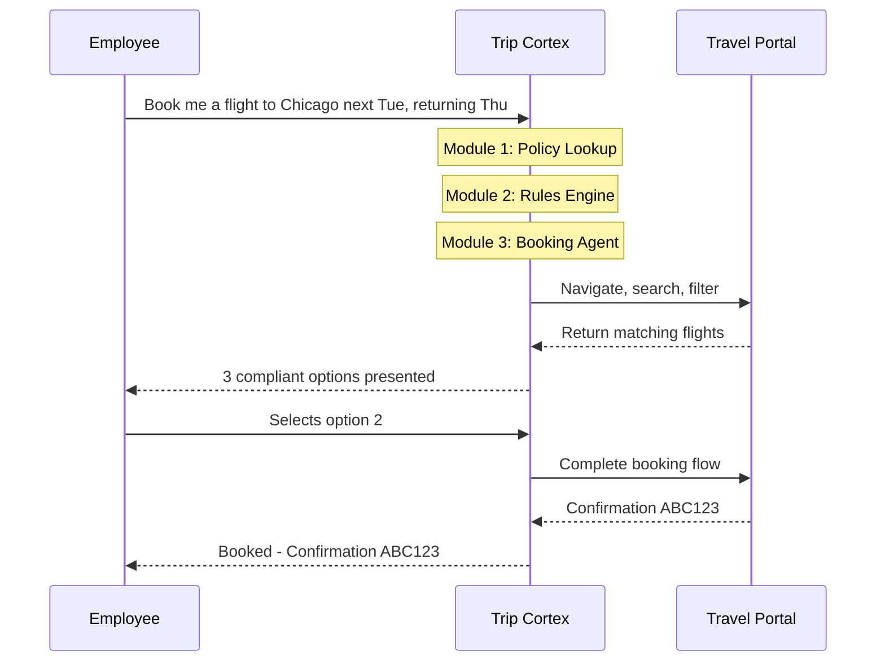

# Trip Cortex Assistant — Product Requirements Document

> Related docs: [Architecture Overview](02-architecture-overview.md) · [Ingestion Pipeline](03-module-ingestion-pipeline.md) · [Rules Engine](04-module-rules-engine.md) · [Booking Agent](05-module-booking-agent.md)

---

## 1. Executive Summary

Trip Cortex Assistant is an AI-powered corporate travel booking system that automates policy enforcement during employee travel booking. It combines three AWS AI services to understand multi-format policy documents, reason about employee requests, and autonomously execute compliant bookings on web portals.

| Attribute | Detail |
|---|---|
| Target Users | Corporate employees, travel managers, finance teams |
| Primary Goal | Automate policy-compliant travel booking via natural language |
| Key Outcome | Reduce policy violations by up to 80%, cut booking time from hours to minutes |
| MVP Focus | Airfare booking with simplified policy enforcement |

---

## 2. Problem Statement

Corporate travel booking today suffers from three core issues:

1. Employees frequently violate travel policies because the documents are long, complex, and scattered across formats (PDFs with tables, logos, screenshots).
2. Manual compliance review by travel managers is slow and error-prone, creating bottlenecks.
3. Booking across multiple portals is tedious — employees spend hours comparing options that may not even be policy-compliant.

Trip Cortex eliminates these friction points by acting as a personal travel assistant that understands both the employee's intent and the company's rules, then autonomously books the optimal compliant itinerary.

---

## 3. Product Vision

> "Just tell me where to go."

An agent that takes a simple natural language request like *"Book me a flight to Chicago next Tuesday returning Thursday"* and handles everything: policy lookup, compliance checking, portal navigation, option ranking, and booking — with human confirmation before payment.

---

## 4. Core Capabilities

### 4.1 Multi-Modal Policy Understanding
- Ingests corporate travel policy documents containing text, tables, logos, and screenshots
- Amazon Bedrock Data Automation (BDA) parses PDFs into structured entities
- Nova Multimodal Embeddings generates semantic embeddings for each entity
- Enables natural language queries against the full policy corpus

### 4.2 Natural Language Booking
- Employees express travel needs in plain language
- The system extracts structured booking parameters (destination, dates, preferences)
- No forms to fill, no portals to navigate manually

### 4.3 Automated Compliance Checking
- Enforces budget caps, preferred vendors, fare classes, and advance booking windows
- Every option presented is pre-filtered against company policy
- Decisions are logged for audit trails

### 4.4 Autonomous Web Navigation
- Browser automation searches, selects, and books on approved travel portals
- Handles form filling, filter application, and multi-step booking flows
- Works with corporate portals (Concur, Amex GBT) or vendor sites

### 4.5 Human-in-the-Loop Confirmation
- Presents ranked compliant options to the employee before any commitment
- User selects preferred option; agent completes booking
- Final payment step requires explicit user approval

---

## 5. Key Technologies

| Technology | Role |
|---|---|
| Python 3.12 | Runtime for all Lambda functions and backend logic |
| uv | Dependency management, lockfiles, virtual environments |
| Amazon Bedrock Data Automation (BDA) | PDF parsing with layout-aware text, table, and figure extraction |
| Amazon Nova Multimodal Embeddings | Semantic search and retrieval from multi-format policy documents |
| Amazon Nova 2 Lite | Reasoning, planning, and rule application (fast, cost-effective inference) |
| Amazon Nova Act | Reliable browser automation and UI interaction |
| Amazon Bedrock | Foundation model hosting and management |
| AWS Lambda | Serverless compute for backend orchestration |
| AWS Step Functions | Workflow coordination, HITL pauses, retry logic |
| Amazon S3 | Policy document and asset storage |
| Amazon DynamoDB | Booking records, user sessions, audit logs |
| Aurora PostgreSQL Serverless v2 | Vector storage (pgvector) for policy embeddings |
| Amazon CloudWatch | Monitoring, alerting, and observability |

---

## 6. System Modules

The system operates as a pipeline of three specialized agents, each responsible for a distinct phase of the booking workflow.

### Module 1: Policy Knowledge Base (BDA + Nova Multimodal Embeddings)

Purpose: Transform corporate travel policy documents into a searchable semantic index.

| Aspect | Detail |
|---|---|
| Input | Company travel policy PDF (text, tables, logos, screenshots) |
| Document Parsing | Amazon Bedrock Data Automation (BDA) |
| Storage | Amazon S3 (raw documents + BDA output artifacts) |
| Embedding Model | Nova Multimodal Embeddings via Bedrock |
| Vector Store | Aurora PostgreSQL Serverless v2 with pgvector |
| Output | Searchable index mapping employee queries to relevant policy snippets |

Process Flow:
1. Policy PDF is uploaded to S3
2. Amazon Bedrock Data Automation (BDA) parses the document into structured entities (text, tables, figures) with layout-aware extraction
3. Nova Multimodal Embeddings generates vector representations for each BDA entity
4. Vectors are stored in the vector database with metadata (section title, page number, content type, reading order, BDA entity ID)
5. At query time, employee requests are embedded and matched against stored vectors via similarity search

> Full technical details: [03-module-ingestion-pipeline.md](03-module-ingestion-pipeline.md)

### Module 2: Rules Engine (Nova 2 Lite)

Purpose: Interpret employee requests against policy context and produce structured booking constraints.

| Aspect | Detail |
|---|---|
| Input | Employee natural language request + relevant policy snippets from Module 1 |
| Model | Nova 2 Lite via Bedrock Converse API |
| Output | Structured JSON booking plan |

> Full technical details: [04-module-rules-engine.md](04-module-rules-engine.md)

### Module 3: Booking Agent (Nova Act)

Purpose: Autonomously navigate travel portals to find, rank, and book compliant flights.

| Aspect | Detail |
|---|---|
| Input | Structured booking plan from Module 2 |
| Technology | Nova Act (browser automation) deployed on AgentCore Runtime |
| Target Portals | Corporate travel portal (Concur, Amex GBT) or vendor sites |
| Output | Confirmed booking record |

> Full technical details: [05-module-booking-agent.md](05-module-booking-agent.md)

---

## 7. User Interaction Flow

---

## 8. MVP Specification

### 8.1 Scope

| Feature | Included |
|---|---|
| Policy document | Simplified PDF with text rules and preferred airline logos |
| User input | Destination, dates, approximate time via chat |
| Booking platform | Single portal (demo instance or public site like Expedia, marked non-production) |
| Compliance: max price | Yes — enforce $500 cap |
| Compliance: cabin class | Yes — enforce economy |
| Compliance: preferred airlines | Yes — prioritize listed carriers |
| Output | Top 3 compliant options; user selects; agent navigates to confirmation page |
| Payment | Simulated (agent stops at confirmation page) |
| Audit logging | All actions and decisions logged |

### 8.2 Out of Scope (MVP)

- Multiple travel portal support
- Hotel or car rental bookings
- Corporate identity provider integration (SSO/SAML)
- Actual payment processing
- Multi-leg or international itineraries
- Group bookings
- Expense report integration

### 8.3 MVP Success Criteria

| Metric | Target |
|---|---|
| Policy compliance rate | 100% of presented options are within policy |
| Booking time (user perspective) | Under 5 minutes from request to confirmation page |
| Option retrieval accuracy | At least 3 valid options returned for standard domestic routes |
| Audit completeness | Every decision point logged with reasoning |

---

## 9. Assumptions and Dependencies

### Assumptions
- Corporate travel policy is available as a PDF document
- At least one travel booking portal is accessible via browser automation
- Employees have a chat interface (web or Slack/Teams integration) to interact with the agent
- Policy changes are infrequent (monthly or quarterly updates)

### Dependencies
- Amazon Bedrock availability for BDA, Nova Multimodal Embeddings, Nova 2 Lite
- Amazon Nova Act service availability
- Travel portal UI stability (browser automation is sensitive to UI changes)
- Network access from Lambda/compute to travel portal endpoints

---

## 10. Future Roadmap (Post-MVP)

| Phase | Features |
|---|---|
| Phase 2 | Multi-portal support, hotel booking, car rental |
| Phase 3 | Corporate SSO integration, actual payment processing |
| Phase 4 | International travel (visa requirements, multi-currency), group bookings |
| Phase 5 | Expense report auto-generation, spend analytics dashboard |
| Phase 6 | Proactive rebooking (price drops, schedule changes), travel risk alerts |

---

## 11. Open Questions

| # | Question | Owner | Status |
|---|---|---|---|
| 1 | Which corporate travel portal will be used for MVP testing? | Engineering | Resolved — Build a dummy travel portal with deterministic seed data. See ADR-006. |
| 2 | How will employee authentication be handled in the chat interface? | Engineering | Resolved — Clerk with provider-agnostic abstraction layer. See ADR-008. |
| 5 | What approval workflow exists for bookings that exceed policy limits? | Product | Open |
| 7 | Should the system support multiple concurrent booking sessions per employee? | Product | Open |
