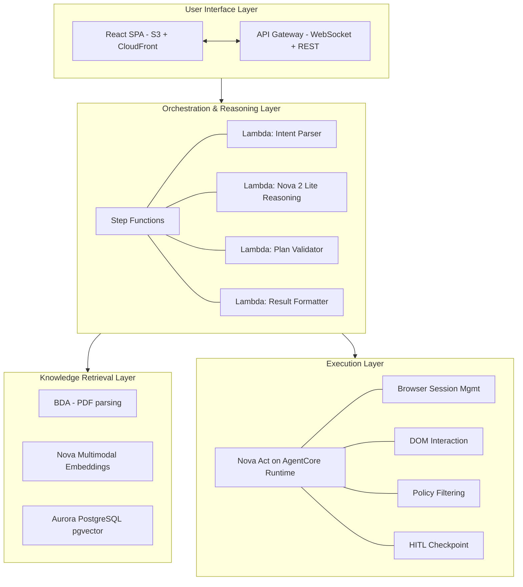
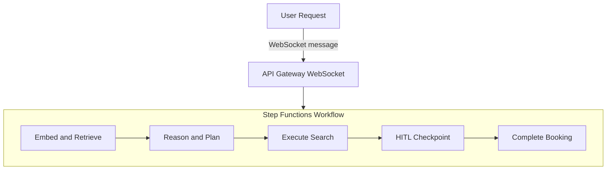

# Trip Cortex Assistant — Architecture Overview

> Related docs: [PRD](01-prd.md) · [Ingestion Pipeline](03-module-ingestion-pipeline.md) · [Rules Engine](04-module-rules-engine.md) · [Booking Agent](05-module-booking-agent.md) · [Infrastructure](06-infrastructure.md) · [Error Handling](07-error-handling.md) · [Security](08-security.md) · [Observability](10-observability.md)

---

## 1. High-Level Architecture

The system follows an event-driven, agentic Retrieval-Augmented Generation (RAG) architecture with a clear separation between the reasoning plane and the execution plane. This separation is critical: the reasoning layer (Nova 2 Lite) produces deterministic, validated JSON plans, and the execution layer (Nova Act) consumes them — ensuring that browser automation never operates on unvalidated intent.

### Four Architectural Layers

### Supporting Infrastructure

| Service | Role |
|---|---|
| Bedrock Data Automation | PDF parsing, table/figure extraction |
| DynamoDB | Booking records, session state, connection tracking, audit logs (separate table — see ADR-014) |
| S3 | Policy PDFs, BDA output, screenshots, artifacts |
| Secrets Manager | Portal credentials, API keys |
| CloudWatch | Metrics, logs, alarms, dashboards |
| IAM | Service-to-service auth, least privilege |
| SQS | Async decoupling for long-running tasks |

---

## 3. Step-by-Step Execution Flow

| Step | Description |
|---|---|
| User Request | Employee sends natural language request, e.g. "Flight to Chicago next Tue, returning Thu, prefer United" |
| API Gateway | Routes to Connection Manager Lambda, stores connectionId in DynamoDB, triggers Step Functions |
| Embed and Retrieve | Embed query via Nova MME, search pgvector for top-5 policy chunks (cosine similarity >= 0.65) |
| Reason and Plan | Invoke Nova 2 Lite (Converse API, Extended Thinking: medium), output BookingPlan JSON, validate with Pydantic (retry max 2 on failure) |
| Execute Search | Invoke Nova Act on AgentCore Runtime with BookingPlan, navigate portal, fill forms, extract and filter options, return top 3 compliant |
| HITL Checkpoint | Send options to user via WebSocket, pause with waitForTaskToken, resume on SendTaskSuccess |
| Complete Booking | Nova Act fills passenger details, navigates to confirmation, captures confirmation number, stores record in DynamoDB, sends confirmation via WebSocket |

---

## 10. Open Questions Resolved & Remaining

### Resolved by This Architecture

| # | Original Question | Resolution |
|---|---|---|
| 3 | What is the fallback if Nova Act cannot complete a booking flow? | Three-layer fallback: retry with re-orientation → deep link URL construction → human travel team handoff |
| 4 | Will policy updates trigger automatic re-embedding? | Yes — S3 event notification on new PDF upload triggers Lambda → BDA parsing → Nova MME embedding pipeline automatically |

### Remaining Open Questions

| # | Question | Owner | Impact |
|---|---|---|---|
| 1 | Which corporate travel portal will be used for MVP testing? | Engineering | Resolved — Dummy travel portal with deterministic data. See ADR-006. |
| 2 | How will employee authentication be handled? | Engineering | Resolved — Clerk with provider-agnostic abstraction layer. See ADR-008. |
| 5 | What approval workflow exists for over-policy bookings? | Product | Determines whether Step Functions needs an additional approval HITL step |
| 6 | What is the Nova Act AgentCore Runtime pricing model? | Engineering | Affects cost projections for production scale |
| 7 | Should the system support multiple concurrent booking sessions per employee? | Product | Affects DynamoDB schema and Step Functions concurrency controls |

---

## 11. Technology Reference Matrix

| Technology | Version/Model ID | Documentation |
|---|---|---|
| Python | 3.12 (Lambda managed runtime) | [Lambda Python Runtimes](https://docs.aws.amazon.com/lambda/latest/dg/lambda-python.html) |
| uv | Latest | [uv Docs](https://docs.astral.sh/uv/) |
| Pydantic | v2 | [Pydantic Docs](https://docs.pydantic.dev/latest/) |
| structlog | Latest | [structlog Docs](https://www.structlog.org/) |
| Amazon Bedrock Data Automation (BDA) | — | [BDA Overview](https://docs.aws.amazon.com/bedrock/latest/userguide/bda.html), [API Usage](https://docs.aws.amazon.com/bedrock/latest/userguide/bda-using-api.html), [Document Output](https://docs.aws.amazon.com/bedrock/latest/userguide/bda-output-documents.html) |
| Amazon Nova 2 Lite | `us.amazon.nova-2-lite-v1:0` | [Nova 2 User Guide](https://docs.aws.amazon.com/nova/latest/nova2-userguide/what-is-nova-2.html) |
| Amazon Nova Multimodal Embeddings | `amazon.nova-2-multimodal-embeddings-v1:0` | [Embeddings Guide](https://docs.aws.amazon.com/nova/latest/userguide/nova-embeddings.html), [Schema Reference](https://docs.aws.amazon.com/nova/latest/userguide/embeddings-schema.html) |
| Amazon Nova Act | SDK: `nova-act` (pip) | [Nova Act User Guide](https://docs.aws.amazon.com/nova-act/latest/userguide/interfaces.html), [GitHub](https://github.com/aws/nova-act) |
| Amazon Bedrock AgentCore Runtime | — | [AgentCore Docs](https://docs.aws.amazon.com/bedrock-agentcore/latest/devguide/) |
| Amazon Bedrock Converse API | — | [Converse API](https://docs.aws.amazon.com/nova/latest/nova2-userguide/using-converse-api.html) |
| Extended Thinking (Nova 2) | `reasoningConfig` with `type: enabled` | [Extended Thinking](https://docs.aws.amazon.com/nova/latest/nova2-userguide/extended-thinking.html) |
| Aurora PostgreSQL + pgvector | PostgreSQL 15+, pgvector 0.5+ | [pgvector on RDS](https://docs.aws.amazon.com/AmazonRDS/latest/UserGuide/postgresql-vector.html) |
| AWS Step Functions | Standard Workflows | [Step Functions Docs](https://docs.aws.amazon.com/step-functions/) |
| AWS SAM | — | [SAM Docs](https://docs.aws.amazon.com/serverless-application-model/) |
| Clerk | Backend: `clerk-backend-api` (Python), Frontend: `@clerk/clerk-js` | [Clerk Docs](https://clerk.com/docs), [Python SDK](https://github.com/clerk/clerk-sdk-python), [clerk-js](https://clerk.com/docs/references/javascript/overview) |
| Amazon Nova (v1 models) | — | [Nova v1 User Guide](https://docs.aws.amazon.com/nova/latest/userguide/what-is-nova.html) (reference only — this project uses Nova 2) |

---

## 12. Architecture Decision Records (ADRs)

### ADR-001: Step Functions over Pure Lambda Orchestration

- Context: The original design uses Lambda for all orchestration. HITL pauses and Nova Act execution times can exceed Lambda's 15-minute limit.
- Decision: Use AWS Step Functions Standard Workflows as the primary orchestrator, with Lambda functions as individual task executors.
- Consequence: Adds ~$0.025 per 1,000 state transitions. Gains native retry, HITL support, and execution history.

### ADR-002: Aurora Serverless v2 over RDS PostgreSQL

- Context: The original design recommends RDS PostgreSQL. A serverless-first architecture benefits from auto-scaling.
- Decision: Use Aurora PostgreSQL Serverless v2 with pgvector.
- Consequence: Higher per-ACU cost than provisioned RDS, but eliminates capacity planning and scales to zero during off-hours.

### ADR-003: Nova MME 1024 Dimensions

- Context: Nova MME supports 3072, 1024, 384, and 256 dimensions.
- Decision: Use 1024 for MVP. The policy corpus is small (< 100 pages), so 3072 offers diminishing returns, while 384/256 risk precision loss on nuanced policy distinctions.
- Consequence: ~4KB per vector. For 1,000 chunks, total vector storage is ~4MB — negligible.

### ADR-004: WebSocket over REST + Polling

- Context: Nova Act workflows take 30–120 seconds. REST APIs with polling create unnecessary load and poor UX.
- Decision: Use API Gateway WebSocket for real-time bidirectional communication.
- Consequence: Requires connection state management (DynamoDB) and heartbeat mechanism. Provides real-time progress updates and HITL interaction.

### ADR-005: AgentCore Runtime over Lambda-hosted Nova Act

- Context: Nova Act can run locally via the SDK, but Lambda's 15-minute timeout and lack of browser environment make it unsuitable for production.
- Decision: Deploy Nova Act workflows to Amazon Bedrock AgentCore Runtime via the Nova Act CLI.
- Consequence: Serverless browser sessions managed by AWS. No headless Chrome provisioning. Native CloudWatch integration.

### ADR-006: Dummy Travel Portal for MVP Development

- Context: Open question #1 from the PRD — "Which corporate travel portal will be used for MVP testing?" Using a real portal (Concur, Expedia, Google Flights) introduces uncontrolled variables: DOM changes break Nova Act workflows, rate limiting and CAPTCHAs block automation, and test data is unpredictable. This makes development and CI/CD unreliable.
- Decision: Build a lightweight dummy travel portal for MVP development and testing. The portal will:
  - Serve a realistic flight search UI (search form, results list, booking flow, confirmation page)
  - Return deterministic, seed-controlled flight data (airlines, prices, times, stops)
  - Mimic real portal DOM patterns (form inputs, filters, result cards) so Nova Act workflows transfer to real portals later
  - Support configurable scenarios (no results, sold-out flights, price changes mid-booking) for error handling validation
  - Be deployed as a static site (S3 + CloudFront) or simple containerized app for shared team access
  - Double as the canary test target in CI/CD
- Consequence: Nova Act workflows developed against the dummy portal will need adaptation when switching to a real portal (different selectors, flow steps). However, the natural language instruction approach of Nova Act minimizes this — instructions like "search for flights from X to Y" are portal-agnostic. The dummy portal eliminates the biggest blocker for parallel development of Modules 1-2 and Module 3.

### ADR-008: Clerk for Authentication with Provider-Agnostic Abstraction Layer

- Context: Open question #2 — "How will employee authentication be handled?" Options evaluated: Amazon Cognito (native but vendor lock-in), self-hosted open source (Keycloak, Authentik, Ory — operational overhead), and managed third-party providers (Clerk, Auth0). The team wants a polished developer experience with minimal auth infrastructure, but without hard coupling to any single provider.
- Decision: Use Clerk as the authentication provider for MVP. The auth flow is split across frontend and backend:
  - Frontend (React SPA): Builds a fully custom sign-in/sign-up UI (no Clerk prebuilt components). The frontend calls Clerk's Frontend API (FAPI) directly — either via the `@clerk/clerk-js` SDK or raw HTTP calls to FAPI — to authenticate the user and obtain a session JWT.
  - Backend (Python/Lambda): Uses the `clerk-backend-api` Python SDK exclusively for JWT verification and user management. The backend never handles sign-in/sign-up flows — it only validates tokens issued by Clerk.
  - All Clerk-specific backend code is isolated behind a provider-agnostic abstraction layer:
    - `AuthProvider` interface — defines `verify_token(token) -> AuthUser`, `get_user(user_id) -> AuthUser`, and `decode_claims(token) -> dict`. All backend code depends on this interface, never on Clerk directly.
    - `ClerkAuthProvider` — implements `AuthProvider` using Clerk's Python Backend SDK. This is the only module that imports Clerk.
    - `AuthUser` model — a Pydantic model (`user_id`, `email`, `name`, `roles`, `metadata`) that the rest of the system uses. Maps from Clerk's user object in one place.
    - `AuthMiddleware` — a Lambda authorizer that calls `AuthProvider.verify_token()` and injects `AuthUser` into the request context. Swapping providers means changing one dependency injection binding.
- Integration with API Gateway WebSocket:
  - Frontend authenticates the user via Clerk FAPI and obtains a session JWT.
  - `$connect` route passes the JWT (via query string or header). A Lambda authorizer validates it using the `AuthProvider` interface.
  - On successful auth, `employeeId` (mapped from Clerk's `user_id`) is stored in the DynamoDB connections table alongside the `connectionId`.
  - All downstream Lambdas receive `employeeId` from the connection record, never from the token directly — decoupling auth from business logic.
- Swapping Clerk later requires:
  - Frontend: Replace Clerk FAPI calls with the new provider's sign-in flow (e.g., Cognito Hosted UI, Keycloak JS adapter). The custom UI components stay — only the API calls behind them change.
  - Backend: Implement a new class (e.g., `CognitoAuthProvider`) that satisfies the `AuthProvider` interface. Update the DI binding. No changes to business logic, DynamoDB schemas, or Step Functions.
- Consequence: Clerk provides a fast MVP path — the frontend owns the auth UI entirely (custom design, no Clerk branding), while the backend only verifies JWTs via the abstraction layer. Clerk's free tier covers 10,000 MAUs. The abstraction layer adds ~50 lines of backend code but ensures the auth provider is a swappable module, not a load-bearing dependency.

### ADR-007: Single Active Booking per Employee (MVP) with Future-Ready Schema

- Context: Supporting concurrent bookings per employee adds significant complexity to DynamoDB session management, WebSocket message routing (each response must be tagged to a specific booking), Step Functions concurrency controls, and frontend state management. For MVP, the user base is small and the primary goal is validating the end-to-end flow.
- Decision: Enforce one active booking per employee in MVP. The Connection Manager Lambda rejects new booking requests if an active Step Functions execution exists for that `employeeId`. However, the underlying data model is designed to support concurrency later:
  - Bookings table uses `employeeId` (PK) + `bookingId` (SK) — supports multiple bookings per employee without migration.
  - All WebSocket messages include a `bookingId` field even in MVP — frontend can already correlate messages to bookings.
  - Audit log entries are keyed by `bookingId`, not `employeeId` — no schema change needed when concurrency is enabled.
  - Step Functions execution name includes `bookingId` — enables per-booking observability from day one.
  - SQS is placed between BDA completion and the embedding Lambda in the ingestion pipeline — smooths burst processing when multiple policy PDFs are uploaded simultaneously.
- Consequence: Simpler MVP implementation. Lifting the single-booking restriction later requires only a configuration change in the Connection Manager Lambda (remove the active-execution check) and frontend updates to render multiple in-flight bookings. No data model migration needed.

### ADR-009: Python 3.12 as Runtime

- Context: The project needs a Python version that is supported by AWS Lambda managed runtimes, has strong library compatibility (Pydantic v2, boto3, clerk-backend-api, structlog, nova-act), and offers good performance. Python 3.13 is not yet available as a Lambda managed runtime. Python 3.11 is stable but will reach Lambda deprecation sooner.
- Decision: Use Python 3.12 as the runtime for all Lambda functions and local development.
- Consequence: Access to latest Lambda managed runtime with performance improvements (PEP 684 per-interpreter GIL), built-in `tomllib`, and full library compatibility. Avoids the container-based deployment overhead that Python 3.13 would require.

### ADR-010: uv for Dependency Management

- Context: The project needs a dependency manager that handles lockfiles, virtual environments, and can export `requirements.txt` for SAM builds. Options evaluated: Poetry (mature but slow resolution, non-standard pyproject.toml extensions), pip + pip-tools (universal but manual workflow), PDM (PEP-compliant but smaller community), uv (fast, Rust-based, standard pyproject.toml).
- Decision: Use uv for all dependency management, virtual environment creation, and lockfile generation.
- Consequence: 10-100x faster dependency resolution and installation compared to pip/Poetry, which noticeably improves CI/CD build times and Lambda layer packaging. Uses standard `pyproject.toml` format. Exports `requirements.txt` via `uv pip compile` for SAM compatibility. Team needs to install uv (`pip install uv` or via the standalone installer).

### ADR-011: Monorepo with Shared Core Package

- Context: The system has 3 tightly coupled modules that share Pydantic models (BookingPlan, AuthUser), database clients (Aurora, DynamoDB), auth abstractions (AuthProvider), config, and error types. Options evaluated: multi-repo (independent deploy cycles but shared code requires publishing packages to CodeArtifact, cross-module changes need coordinated PRs), monorepo (single repo, shared code via local imports, atomic changes).
- Decision: Use a monorepo structure with a shared `src/core/` package. Lambda handlers are thin entry points that import from `core/`. The dummy travel portal and React frontend live in the same repo as separate sub-projects.
- Consequence: Shared code is a simple Python import — no package publishing, no version coordination. Atomic cross-module changes in a single PR. Single CI/CD pipeline. Trade-off: CI needs path-based filtering to avoid rebuilding everything on every commit.

### ADR-012: Bundle-per-Function for Shared Code Deployment

- Context: Lambda functions need access to the shared `core/` package. Options: Lambda Layer (single artifact, all functions reference it, but adds layer versioning complexity), bundle per function (SAM copies core into each function's build, self-contained but duplicated), private PyPI (overkill for monorepo).
- Decision: Bundle the shared `core/` package into each Lambda function's deployment artifact via SAM's `sam build`. The `core/` package is listed as a local path dependency in `pyproject.toml`.
- Consequence: Each Lambda is self-contained with no external layer dependency. Slightly larger total deployment size due to duplicated core code (~50-100KB per function), but well within Lambda's 250MB limit. Migrate to Lambda Layer if package sizes become a concern at scale.

### ADR-013: Local Development with Docker Compose + Direct Handler Invocation

- Context: The system depends on Aurora PostgreSQL (pgvector), DynamoDB, and Bedrock AI services. Options evaluated: SAM Local (simulates Lambda but no WebSocket or Step Functions support), LocalStack (emulates AWS but no Aurora/Bedrock in free tier), Docker Compose for data stores + direct pytest invocation (real databases, fast iteration, mocked AI services).
- Decision: Use Docker Compose for local data stores (PostgreSQL 15 + pgvector, DynamoDB Local) and invoke Lambda handlers directly in tests as Python functions. Bedrock calls are mocked with recorded fixtures in unit/integration tests. SAM Local is used only for pre-deployment smoke tests. Full integration testing with real Bedrock happens in a shared dev AWS account via `sam deploy`.
- Consequence: Fast local iteration — no Lambda simulation overhead during development. Real pgvector queries in tests. Trade-off: local environment doesn't perfectly replicate Lambda execution context (event format, context object), but thin handlers minimize this gap. See [12-project-structure.md](12-project-structure.md) for the Docker Compose configuration.

### ADR-014: Separate DynamoDB Table for Audit Logs

- Context: Every Step Functions step generates audit entries (policy evaluation, reasoning output, Nova Act actions, HITL decisions). The system needs to store these for compliance and debugging. Options evaluated: (1) Separate `AuditLogTable`, (2) Audit items in `BookingsTable` using SK prefix pattern (`bookingId#audit#<ULID>`), (3) CloudWatch Logs only.
- Decision: Use a dedicated `AuditLogTable` with `bookingId` (PK) + `auditId` (SK, ULID — sortable and unique). A GSI on `employeeId` (PK) + `timestamp` (SK) supports compliance queries by employee. TTL on `expiresAt` attribute enables independent retention policy.
- Rationale:
  - Audit volume is 10-15x booking volume (every workflow step logs). Separate table isolates write throughput and capacity monitoring.
  - IAM least privilege: Lambdas that write audit entries (ReasonAndPlan, EmbedAndRetrieve, ExecuteSearch) get write access to the audit table only, not to booking records. Matches the per-function scoping in [08-security.md](08-security.md).
  - Independent TTL: booking records may need indefinite retention, audit logs have a compliance window (e.g., 2 years). Separate table = separate TTL policy without filtering logic.
  - Query patterns differ: bookings are read-heavy (lookup by employee), audit is write-heavy (append) with occasional read (investigation/compliance). Separate tables let DynamoDB optimize partition distribution for each.
  - CloudWatch Logs (option 3) was rejected because the documented audit schema requires real-time queryability and structured joins with booking data, which Logs Insights cannot provide at millisecond latency.
  - Single-table design (option 2) was rejected because it creates hot partitions during booking flows (booking item + 10-15 audit items on the same `employeeId` partition in rapid succession), complicates TTL management, and forces coarser IAM policies.
- Consequence: One additional DynamoDB table (~10 lines in SAM template). Audit writes are fire-and-forget from the handler perspective — failures are retried via SQS DLQ, never blocking the booking flow. The `dynamo.py` client exposes a separate `AuditClient` class alongside `BookingsClient` and `ConnectionsClient`.

---

*Document authored as part of the Trip Cortex Assistant system design review. All technical claims verified against official AWS documentation as of February 2026. Sources: [Nova v1 User Guide](https://docs.aws.amazon.com/nova/latest/userguide/what-is-nova.html), [Nova 2 User Guide](https://docs.aws.amazon.com/nova/latest/nova2-userguide/what-is-nova-2.html), [Nova Embeddings Schema](https://docs.aws.amazon.com/nova/latest/userguide/embeddings-schema.html), [Nova 2 Extended Thinking](https://docs.aws.amazon.com/nova/latest/nova2-userguide/extended-thinking.html), [Nova Act Interfaces](https://docs.aws.amazon.com/nova-act/latest/userguide/interfaces.html).*
