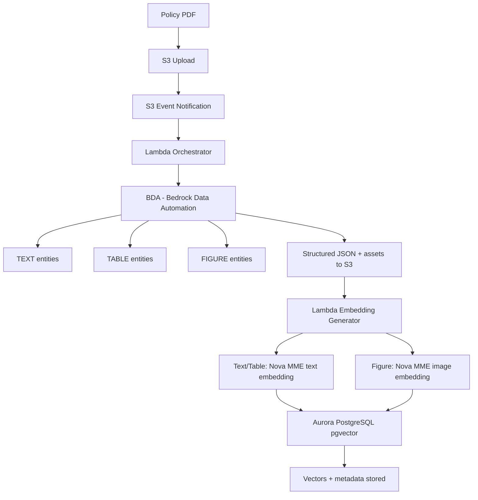

# Module 1: Policy Knowledge Base — Ingestion & Retrieval

> Related docs: [PRD](01-prd.md) · [Architecture Overview](02-architecture-overview.md) · [Rules Engine](04-module-rules-engine.md) · [Infrastructure](06-infrastructure.md) · [Cost Estimation](11-cost-estimation.md)

---

This module converts multimodal corporate travel policies into a searchable vector space.

## 2.1.1 Ingestion Pipeline (Amazon Bedrock Data Automation → Nova MME)

Amazon Bedrock Data Automation (BDA) is a GenAI-powered capability of Bedrock that processes unstructured multimodal content (documents, images, video, audio) into structured formats via a single unified API. It eliminates the need to orchestrate custom PDF parsing libraries.



Embedding config: `embeddingPurpose: GENERIC_INDEX`, `embeddingDimension: 1024`. Figure embeddings use `detailLevel: DOCUMENT_IMAGE`. Metadata includes entity_type, section_title, page_num, reading_order, source_file, bda_entity_id.

## 2.1.2 BDA Configuration & Integration

BDA requires a Data Automation Project that defines how documents are processed. For the travel policy use case:

```python
import boto3
import json

bda_client = boto3.client('bedrock-data-automation', region_name='us-east-1')
bda_runtime = boto3.client('bedrock-data-automation-runtime', region_name='us-east-1')

# Step 1: Create a BDA project (one-time setup)
project_response = bda_client.create_data_automation_project(
    projectName='travel-policy-processor',
    standardOutputConfiguration={
        "document": {
            "state": "ENABLED",
            "extraction": {
                "granularity": {
                    "types": ["DOCUMENT", "PAGE", "ELEMENT"]  # Get all levels
                },
                "boundingBox": {
                    "state": "ENABLED"
                }
            },
            "generativeField": {
                "state": "ENABLED",
                "types": ["DOCUMENT_SUMMARY"]
            },
            "outputFormat": {
                "textFormat": {
                    "types": ["PLAIN_TEXT", "MARKDOWN"]
                },
                "additionalFileFormat": {
                    "state": "ENABLED"  # Get CSV files for tables, cropped images for figures
                }
            }
        }
    }
)
project_arn = project_response['projectArn']

# Step 2: Process a policy PDF (triggered by S3 upload)
def process_policy_pdf(s3_uri: str, output_s3_uri: str) -> str:
    """Invoke BDA to parse a travel policy PDF."""
    response = bda_runtime.invoke_data_automation_async(
        inputConfiguration={'s3Uri': s3_uri},
        outputConfiguration={'s3Uri': output_s3_uri},
        dataAutomationConfiguration={
            'dataAutomationProjectArn': project_arn,
            'stage': 'LIVE'
        }
    )
    return response['invocationArn']

# Step 3: Poll for completion
def check_status(invocation_arn: str) -> dict:
    return bda_runtime.get_data_automation_status(
        invocationArn=invocation_arn
    )
```

BDA output for a document includes structured entities that map directly to embedding inputs:

| BDA Entity Type | Subtypes | Embedding Strategy |
|---|---|---|
| `TEXT` | `TITLE`, `SECTION_TITLE`, `HEADER`, `PARAGRAPH`, `LIST`, `FOOTER` | Nova MME `text` input with `embeddingPurpose: "GENERIC_INDEX"` |
| `TABLE` | — | Nova MME `text` input using the `markdown` or `csv` representation |
| `FIGURE` | `CHART`, graph, logo | Nova MME `image` input with `detailLevel: "DOCUMENT_IMAGE"` using the cropped image from S3 |
| `PAGE` | — | Used for metadata enrichment (page numbers, reading order) |

```python
def generate_embeddings_from_bda_output(bda_output: dict) -> list:
    """Parse BDA document output and generate Nova MME embeddings for each entity."""
    embeddings = []

    bedrock_runtime = boto3.client('bedrock-runtime', region_name='us-east-1')

    for entity in bda_output.get('entities', []):
        entity_type = entity['type']

        if entity_type in ('TEXT', 'TABLE'):
            # Use markdown representation for richer context
            text_content = entity['representation'].get('markdown', entity['representation']['text'])

            request_body = {
                "taskType": "SINGLE_EMBEDDING",
                "singleEmbeddingParams": {
                    "embeddingPurpose": "GENERIC_INDEX",
                    "embeddingDimension": 1024,
                    "text": {
                        "truncationMode": "END",
                        "value": text_content
                    }
                }
            }

            response = bedrock_runtime.invoke_model(
                body=json.dumps(request_body),
                modelId="amazon.nova-2-multimodal-embeddings-v1:0",
                accept="application/json",
                contentType="application/json"
            )
            result = json.loads(response['body'].read())
            vector = result['embeddings'][0]['embedding']

            embeddings.append({
                'vector': vector,
                'content_type': entity_type.lower(),
                'content_text': text_content,
                'source_page': entity.get('page_indices', [None])[0],
                'section_title': entity.get('title', entity.get('sub_type', '')),
                'reading_order': entity.get('reading_order'),
                'bda_entity_id': entity['id']
            })

        elif entity_type == 'FIGURE':
            # Use the cropped image saved by BDA to S3
            crop_image_s3 = entity.get('crop_images', [None])[0]
            if crop_image_s3:
                request_body = {
                    "taskType": "SINGLE_EMBEDDING",
                    "singleEmbeddingParams": {
                        "embeddingPurpose": "GENERIC_INDEX",
                        "embeddingDimension": 1024,
                        "image": {
                            "detailLevel": "DOCUMENT_IMAGE",
                            "format": "png",
                            "source": {
                                "s3Location": {"uri": crop_image_s3}
                            }
                        }
                    }
                }

                response = bedrock_runtime.invoke_model(
                    body=json.dumps(request_body),
                    modelId="amazon.nova-2-multimodal-embeddings-v1:0",
                    accept="application/json",
                    contentType="application/json"
                )
                result = json.loads(response['body'].read())
                vector = result['embeddings'][0]['embedding']

                embeddings.append({
                    'vector': vector,
                    'content_type': 'figure',
                    'content_text': entity.get('summary', entity.get('title', '')),
                    'source_page': entity.get('page_indices', [None])[0],
                    'section_title': entity.get('title', ''),
                    'reading_order': entity.get('reading_order'),
                    'bda_entity_id': entity['id']
                })

    return embeddings
```

---

## 2.1.3 Why BDA Over Custom Parsing

| Approach | Pros | Cons |
|---|---|---|
| BDA (chosen) | Fully managed, handles tables/figures/layout natively, provides reading order and bounding boxes, generates summaries, outputs cropped figure images to S3, supports up to 3000 pages with splitter | Per-page pricing, async-only for documents |
| PyMuPDF / pdfplumber | Free, synchronous, fine-grained control | No table structure understanding, no figure extraction, no reading order, requires custom chunking logic |
| Amazon Textract | Strong OCR and table extraction | No figure understanding, no semantic layout analysis, separate service to orchestrate |

BDA is the right choice here because travel policy PDFs contain mixed content (text rules, fare tables, airline logo charts) that requires layout-aware parsing. BDA's element-level granularity with `TEXT`, `TABLE`, and `FIGURE` entity types maps directly to the embedding strategy.

---

## 2.1.4 Embedding Configuration

Per official documentation, Nova Multimodal Embeddings supports four output dimensions via Matryoshka Representation Learning (MRL):

| Dimension | Use Case | Trade-off |
|---|---|---|
| 3072 | Maximum precision, small corpus | Highest storage/compute cost |
| 1024 | Recommended balance for most RAG applications | Good precision, reasonable cost |
| 384 | Large-scale retrieval with cost constraints | Moderate precision loss |
| 256 | Lightweight/edge deployments | Fastest, lowest precision |

Recommendation for MVP: Use 1024 dimensions. This provides strong retrieval quality for a corporate policy corpus (typically < 100 pages) while keeping pgvector index sizes manageable. Note that the default dimension is 3072 — you must explicitly set `embeddingDimension: 1024` in the API request.

The `embeddingPurpose` parameter is critical and was not mentioned in the original design:

- At index time: use `"GENERIC_INDEX"` for all content types
- At query time: use `"DOCUMENT_RETRIEVAL"` when searching document-image embeddings, `"TEXT_RETRIEVAL"` for text-only, or `"GENERIC_RETRIEVAL"` for mixed-modality indexes

---

## 2.1.5 Vector Storage: Aurora PostgreSQL Serverless v2 with pgvector

The original design recommends "Amazon RDS for PostgreSQL with pgvector." For a serverless-first architecture, Aurora PostgreSQL Serverless v2 is the better choice:

- Auto-scales compute (0.5 to 128 ACUs) — no capacity planning needed
- Native pgvector support for HNSW and IVFFlat indexes
- Relational metadata mapping (section titles, page numbers, content types) alongside vectors
- Cost-effective for bursty workloads typical of a corporate travel assistant

Schema design:

```sql
CREATE EXTENSION IF NOT EXISTS vector;

CREATE TABLE policy_chunks (
    id UUID PRIMARY KEY DEFAULT gen_random_uuid(),
    policy_id UUID NOT NULL,
    content_type VARCHAR(20) NOT NULL,  -- 'text', 'table', 'figure'
    content_text TEXT,
    source_page INTEGER,
    section_title VARCHAR(255),
    reading_order INTEGER,              -- BDA reading order for logical sequencing
    bda_entity_id VARCHAR(255),         -- BDA entity ID for traceability
    bda_entity_subtype VARCHAR(50),     -- BDA subtype: TITLE, PARAGRAPH, CHART, etc.
    embedding vector(1024) NOT NULL,
    metadata JSONB,                     -- BDA bounding boxes, crop image URIs, etc.
    created_at TIMESTAMPTZ DEFAULT NOW(),
    updated_at TIMESTAMPTZ DEFAULT NOW()
);

CREATE INDEX idx_policy_chunks_embedding
    ON policy_chunks USING hnsw (embedding vector_cosine_ops)
    WITH (m = 16, ef_construction = 64);

CREATE INDEX idx_policy_chunks_policy_id
    ON policy_chunks (policy_id);
```
