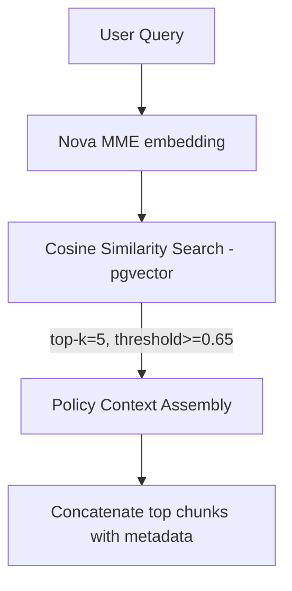

# Module 2: Rules Engine & Planner (Amazon Nova 2 Lite)

> Related docs: [PRD](01-prd.md) · [Architecture Overview](02-architecture-overview.md) · [Ingestion Pipeline](03-module-ingestion-pipeline.md) · [Booking Agent](05-module-booking-agent.md) · [Error Handling](07-error-handling.md)

---

This is the reasoning core. It reconciles user intent with retrieved corporate policy and produces a validated, structured execution plan.

## 2.2.1 Retrieval Flow



---

## 2.2.2 Nova 2 Lite Invocation via Bedrock Converse API

The model ID for Nova 2 Lite is `us.amazon.nova-2-lite-v1:0`. The Converse API call structure:

```python
import boto3
import json

bedrock = boto3.client('bedrock-runtime', region_name='us-east-1')

response = bedrock.converse(
    modelId='us.amazon.nova-2-lite-v1:0',
    system=[{
        "text": """You are a corporate travel policy compliance engine.
        Given an employee's travel request and the relevant policy excerpts,
        produce a structured JSON booking plan.
        Always enforce the strictest applicable policy constraint.
        If any parameter cannot be determined, set it to null and flag it."""
    }],
    messages=[{
        "role": "user",
        "content": [{
            "text": f"""
            EMPLOYEE REQUEST: {user_request}

            RELEVANT POLICY EXCERPTS:
            {formatted_policy_chunks}

            Produce a JSON booking plan following the exact schema provided.
            """
        }]
    }],
    inferenceConfig={
        "temperature": 0.1,  # Low temperature for deterministic policy application
        "topP": 0.9,
        "maxTokens": 4000
    },
    additionalModelRequestFields={
        "reasoningConfig": {
            "type": "enabled",
            "maxReasoningEffort": "medium"
        }
    }
)

# IMPORTANT: When maxReasoningEffort is "high", temperature, topP, and maxTokens
# must be UNSET — the model controls output length autonomously (can exceed 65K tokens).
# Reasoning content in the response will appear as [REDACTED] — you are still billed
# for reasoning tokens as they contribute to improved output quality.
```

---

## 2.2.3 Extended Thinking Configuration

Per the [official Nova 2 documentation](https://docs.aws.amazon.com/nova/latest/nova2-userguide/extended-thinking.html), Extended Thinking is controlled via the `reasoningConfig` parameter with three budget levels:

| Level | `maxReasoningEffort` | Best For | Recommended Use in This System |
|---|---|---|---|
| Low | `"low"` | Tasks with added complexity requiring structured thinking | Simple domestic bookings with clear policy matches |
| Medium | `"medium"` | Multi-step tasks, agentic workflows with multiple constraints | Default for most booking requests — balances speed and accuracy |
| High | `"high"` | STEM reasoning, complex multi-dimensional analysis | International travel with visa requirements, multi-leg itineraries, exception requests |

Design decision: Use medium as the default. The system should dynamically escalate to high when:
- The retrieval step returns low-confidence policy matches (cosine similarity < 0.70)
- The request involves international travel or exception handling
- The first attempt with medium produces an incomplete plan

Important constraints from official docs:
- Extended thinking is off by default (`"type": "disabled"`). You must explicitly set `"type": "enabled"` in `reasoningConfig`.
- When `maxReasoningEffort` is set to `"high"`, you must NOT set `temperature`, `topP`, or `maxTokens` — the model controls output length autonomously and may generate up to 128K tokens for complex problems.
- Reasoning content in the response appears as `[REDACTED]`. You are still billed for reasoning tokens as output tokens. The `reasoningContent` block in the response confirms extended thinking is active.
- Nova 2 Lite supports up to 1M token context window and can generate up to 65,536 tokens per response (or more with high reasoning effort).

---

## 2.2.4 Output Schema (Corrected & Extended)

The original schema is a good start but needs additional fields for auditability and error handling:

```json
{
  "intent": "flight_booking",
  "confidence": 0.95,
  "parameters": {
    "origin": "HYD",
    "destination": "ORD",
    "departure_date": "2026-03-10",
    "return_date": "2026-03-12",
    "cabin_class": "economy",
    "time_preference": "morning",
    "passenger_count": 1
  },
  "policy_constraints": {
    "max_budget_usd": 500,
    "preferred_vendors": ["Delta", "United"],
    "advance_booking_days_required": 14,
    "advance_booking_met": true,
    "requires_approval": false,
    "approval_reason": null
  },
  "policy_sources": [
    {
      "chunk_id": "uuid-here",
      "section_title": "Domestic Air Travel Policy",
      "page": 3,
      "similarity_score": 0.89
    }
  ],
  "reasoning_summary": "Employee requests HYD→ORD round trip. Domestic policy applies: $500 cap, economy class, United/Delta preferred. Departure is 14 days out — advance booking requirement met.",
  "warnings": [],
  "fallback_url": null
}
```

---

## 2.2.5 Schema Validation with Pydantic

```python
from pydantic import BaseModel, Field, model_validator
from typing import List, Optional
from datetime import date

class BookingParameters(BaseModel):
    origin: str = Field(..., min_length=3, max_length=4)
    destination: str = Field(..., min_length=3, max_length=4)
    departure_date: date
    return_date: Optional[date] = None
    cabin_class: str = Field(..., pattern="^(economy|premium_economy|business|first)$")
    time_preference: Optional[str] = None
    passenger_count: int = Field(default=1, ge=1, le=9)

    @model_validator(mode='after')
    def return_after_departure(self) -> 'BookingParameters':
        if self.return_date and self.return_date <= self.departure_date:
            raise ValueError('return_date must be after departure_date')
        return self

class PolicyConstraints(BaseModel):
    max_budget_usd: float = Field(..., gt=0)
    preferred_vendors: List[str]
    advance_booking_days_required: Optional[int] = None
    advance_booking_met: bool
    requires_approval: bool = False
    approval_reason: Optional[str] = None

class BookingPlan(BaseModel):
    intent: str = Field(..., pattern="^(flight_booking|flight_search|policy_query)$")
    confidence: float = Field(..., ge=0.0, le=1.0)
    parameters: BookingParameters
    policy_constraints: PolicyConstraints
    policy_sources: List[dict]
    reasoning_summary: str
    warnings: List[str] = []
    fallback_url: Optional[str] = None
```
