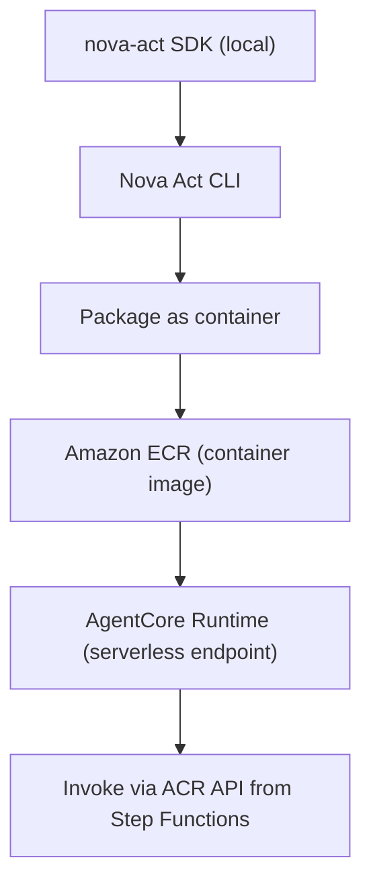
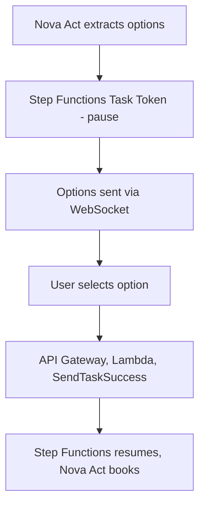

# Module 3: Booking Agent (Amazon Nova Act)

> Related docs: [PRD](01-prd.md) · [Architecture Overview](02-architecture-overview.md) · [Rules Engine](04-module-rules-engine.md) · [Infrastructure](06-infrastructure.md) · [Error Handling](07-error-handling.md)

---

This module translates the validated JSON plan into physical browser interactions on the target travel portal.

## 2.3.1 Critical Correction: Nova Act Architecture

The original design contains two inaccuracies:

1. "Nova Act uses the custom Nova 2 Lite computer-use model" — This is incorrect. Nova Act uses its own frontier computer-use model that was specifically trained via reinforcement learning in synthetic web environments ("web gyms"). It is not a variant of Nova 2 Lite. ([Source: AWS Blog](https://aws.amazon.com/de/blogs/aws/build-reliable-ai-agents-for-ui-workflow-automation-with-amazon-nova-act-now-generally-available/))

2. "Nova Act workflows can be deployed and monitored directly in the Nova Act AWS Console" — This is partially correct but incomplete. Per the [official Nova Act docs](https://docs.aws.amazon.com/nova-act/latest/userguide/interfaces.html), the full lifecycle is:
   - Explore: Nova Act Playground at nova.amazon.com/act (no setup required)
   - Develop: Nova Act SDK (`pip install nova-act`) + IDE extension (VS Code, Cursor, Kiro) — supports both API Key auth (experimentation) and AWS IAM auth (production)
   - Deploy: Nova Act CLI packages scripts into containers and deploys to Amazon Bedrock AgentCore Runtime (ACR) — handles containerization, ECR, S3, and IAM automatically
   - Monitor: Nova Act AWS Console provides observability hierarchy (runs → sessions → acts → steps) with execution traces and S3 artifacts

---

## 2.3.2 Nova Act SDK Integration

```python
from nova_act import NovaAct

async def execute_booking(booking_plan: dict) -> dict:
    """Execute a flight search on the travel portal using Nova Act."""

    params = booking_plan["parameters"]
    constraints = booking_plan["policy_constraints"]

    async with NovaAct(
        starting_page="https://travel-portal.example.com/flights",
        headless=True
    ) as agent:

        # Step 1: Fill search form
        await agent.act(
            f"Search for flights from {params['origin']} to {params['destination']} "
            f"departing {params['departure_date']} "
            f"returning {params['return_date']} "
            f"in {params['cabin_class']} class"
        )

        # Step 2: Apply vendor filter
        if constraints["preferred_vendors"]:
            vendors = ", ".join(constraints["preferred_vendors"])
            await agent.act(
                f"Filter results to show only flights from: {vendors}"
            )

        # Step 3: Apply price filter
        await agent.act(
            f"Filter results to show only flights under ${constraints['max_budget_usd']}"
        )

        # Step 4: Extract results
        result = await agent.act(
            "Extract the top 5 flight options showing airline, price, "
            "departure time, arrival time, and number of stops. "
            "Return as structured data.",
            schema=FlightOptionsSchema  # Pydantic model for structured extraction
        )

        return result
```

---

## 2.3.3 Production Deployment via AgentCore Runtime

For production, Nova Act workflows are not run on local headless browsers or Lambda. They are deployed to Amazon Bedrock AgentCore Runtime (ACR):



Benefits of ACR deployment:
- Serverless — no infrastructure to manage
- Built-in browser environment — no need to provision headless Chrome
- Native CloudWatch integration for observability
- AWS IAM for authentication and access control
- Session isolation for security

---

## 2.3.4 HITL (Human-in-the-Loop) Checkpoint

After Nova Act extracts flight options, the workflow pauses for user confirmation:



This uses Step Functions' native callback pattern (`.waitForTaskToken`) to pause the workflow without consuming compute resources while waiting for user input.
