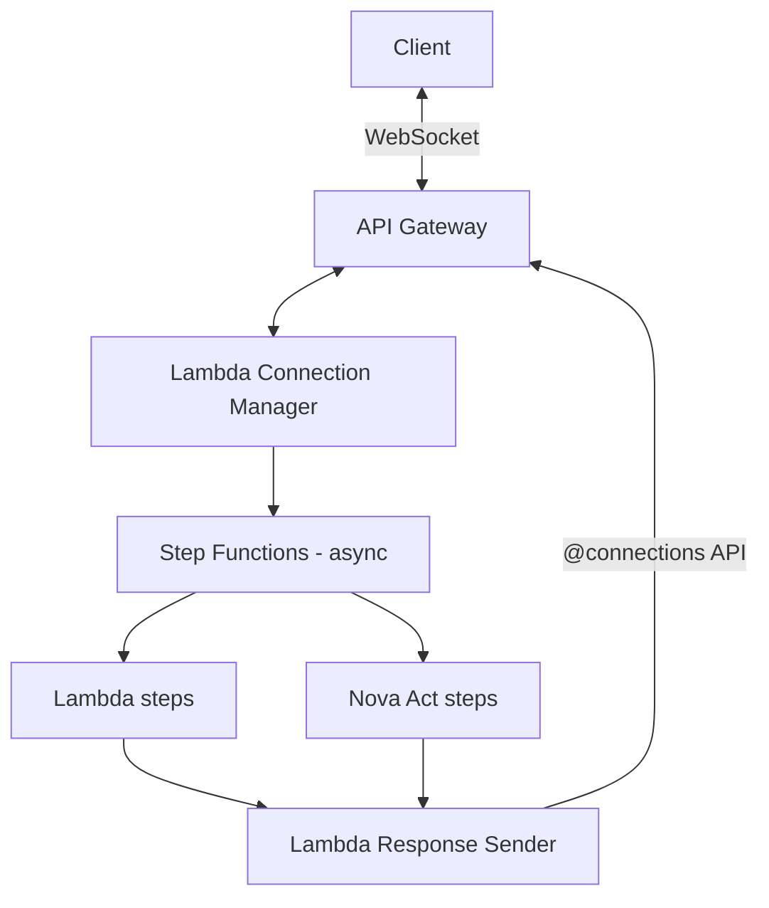

# Infrastructure & Deployment (Serverless)

> Related docs: [Architecture Overview](02-architecture-overview.md) · [Ingestion Pipeline](03-module-ingestion-pipeline.md) · [Error Handling](07-error-handling.md) · [Security](08-security.md) · [Cost Estimation](11-cost-estimation.md) · [Project Structure](12-project-structure.md)

---

## 4.1 Compute Architecture

| Component | Service | Justification |
|---|---|---|
| Language | Python 3.12 | Latest Lambda managed runtime, full library compatibility. See ADR-009. |
| Dependency Management | uv | Fast resolution/install, lockfiles, standard pyproject.toml. See ADR-010. |
| Repository Layout | Monorepo | Shared core package, atomic cross-module changes. See ADR-011. |
| Frontend | S3 + CloudFront | Static SPA hosting, global edge caching |
| API Layer | API Gateway (WebSocket + REST) | WebSocket for real-time status streaming; REST for admin endpoints |
| Workflow Orchestration | AWS Step Functions (Express for < 5 min, Standard for HITL flows) | Coordinates multi-step workflow, handles HITL pauses, manages retries |
| Business Logic | AWS Lambda | Stateless compute for embedding, reasoning, validation |
| Document Parsing | Amazon Bedrock Data Automation (BDA) | Fully managed PDF parsing with layout-aware text, table, and figure extraction |
| Browser Automation | Nova Act on AgentCore Runtime | Serverless browser sessions, no infrastructure management |
| Vector Database | Aurora PostgreSQL Serverless v2 (pgvector) | Auto-scaling, relational metadata, cost-effective for bursty workloads |
| State & Audit | DynamoDB | Booking records, session state, connection tracking, audit logs (separate table — ADR-014) |
| Document Storage | S3 | Policy PDFs, BDA output artifacts, browser screenshots |
| Secrets | AWS Secrets Manager | Portal credentials, API keys |
| Monitoring | CloudWatch | Metrics, logs, alarms, dashboards |
| Authentication | Clerk (backend JWT verification via Python SDK) | Managed auth with provider-agnostic abstraction. See ADR-008. |

---

## 4.2 Why Step Functions, Not Just Lambda

The original design routes everything through Lambda. This is problematic:

1. Lambda has a 15-minute max execution timeout. Nova Act browser sessions can take 30-120 seconds per step, and a full search + booking flow may exceed 15 minutes.
2. The HITL checkpoint (waiting for user selection) could take minutes to hours. Lambda cannot hold a connection open that long.
3. Step Functions Standard Workflows support executions up to 1 year, with native `.waitForTaskToken` for HITL pauses at zero compute cost during the wait.
4. Step Functions provides built-in retry, error handling, and parallel execution — reducing custom error-handling code in Lambda.

---

## 4.3 API Gateway Timeout Mitigation

The original design correctly identifies the 29-second API Gateway timeout as a risk. The solution:



The pattern:
1. Client sends request via WebSocket
2. Lambda immediately starts Step Functions execution and returns an `executionId` to the client (< 1 second)
3. Each step in the workflow sends progress updates to the client via the API Gateway `@connections` POST endpoint
4. No single Lambda invocation needs to exceed 15 minutes
5. WebSocket connections have a 2-hour max duration and 10-minute idle timeout — send periodic heartbeats

---

## 4.4 Infrastructure as Code (AWS SAM)

> Full project structure and file layout: [12-project-structure.md](12-project-structure.md)

```yaml
# template.yaml
AWSTemplateFormatVersion: '2010-09-09'
Transform: AWS::Serverless-2016-10-31

Globals:
  Function:
    Runtime: python3.12
    Timeout: 300
    MemorySize: 512
    Architectures:
      - arm64
    Environment:
      Variables:
        AURORA_CLUSTER_ARN: !GetAtt AuroraCluster.DBClusterArn
        AURORA_SECRET_ARN: !Ref AuroraSecret
        BOOKINGS_TABLE: !Ref BookingsTable
        CONNECTIONS_TABLE: !Ref ConnectionsTable
        AUDIT_LOG_TABLE: !Ref AuditLogTable

Resources:
  # WebSocket API
  WebSocketApi:
    Type: AWS::ApiGatewayV2::Api
    Properties:
      Name: TripCortexWebSocket
      ProtocolType: WEBSOCKET
      RouteSelectionExpression: "$request.body.action"

  # Step Functions State Machine
  BookingWorkflow:
    Type: AWS::Serverless::StateMachine
    Properties:
      DefinitionUri: statemachine/booking-workflow.asl.json
      Type: STANDARD
      Policies:
        - LambdaInvokePolicy:
            FunctionName: !Ref EmbedAndRetrieveFunction
        - LambdaInvokePolicy:
            FunctionName: !Ref ReasonAndPlanFunction
        - LambdaInvokePolicy:
            FunctionName: !Ref ValidatePlanFunction
        - LambdaInvokePolicy:
            FunctionName: !Ref ResponseSenderFunction

  # Lambda Functions — thin handlers importing from src/core/
  ConnectFunction:
    Type: AWS::Serverless::Function
    Properties:
      CodeUri: src/
      Handler: handlers.connect.handler

  DisconnectFunction:
    Type: AWS::Serverless::Function
    Properties:
      CodeUri: src/
      Handler: handlers.disconnect.handler

  BookingRequestFunction:
    Type: AWS::Serverless::Function
    Properties:
      CodeUri: src/
      Handler: handlers.booking_request.handler
      Policies:
        - StepFunctionsExecutionPolicy:
            StateMachineName: !GetAtt BookingWorkflow.Name

  EmbedAndRetrieveFunction:
    Type: AWS::Serverless::Function
    Properties:
      CodeUri: src/
      Handler: handlers.embed_retrieve.handler
      Policies:
        - Statement:
          - Effect: Allow
            Action: bedrock:InvokeModel
            Resource: "arn:aws:bedrock:*::foundation-model/amazon.nova-2-multimodal-embeddings-v1:0"
          - Effect: Allow
            Action:
              - bedrock:InvokeDataAutomationAsync
              - bedrock:GetDataAutomationStatus
            Resource: "*"

  ReasonAndPlanFunction:
    Type: AWS::Serverless::Function
    Properties:
      CodeUri: src/
      Handler: handlers.reason_plan.handler
      Timeout: 180
      Policies:
        - Statement:
          - Effect: Allow
            Action: bedrock:InvokeModel
            Resource: "arn:aws:bedrock:*::foundation-model/us.amazon.nova-2-lite-v1:0"

  ValidatePlanFunction:
    Type: AWS::Serverless::Function
    Properties:
      CodeUri: src/
      Handler: handlers.validate_plan.handler

  ResponseSenderFunction:
    Type: AWS::Serverless::Function
    Properties:
      CodeUri: src/
      Handler: handlers.response_sender.handler
      Policies:
        - Statement:
          - Effect: Allow
            Action: execute-api:ManageConnections
            Resource: !Sub "arn:aws:execute-api:${AWS::Region}:${AWS::AccountId}:${WebSocketApi}/*"

  HeartbeatFunction:
    Type: AWS::Serverless::Function
    Properties:
      CodeUri: src/
      Handler: handlers.heartbeat.handler
      Events:
        Schedule:
          Type: Schedule
          Properties:
            Schedule: rate(5 minutes)

  # DynamoDB Tables
  BookingsTable:
    Type: AWS::DynamoDB::Table
    Properties:
      TableName: TripCortexBookings
      BillingMode: PAY_PER_REQUEST
      AttributeDefinitions:
        - AttributeName: employeeId
          AttributeType: S
        - AttributeName: bookingId
          AttributeType: S
      KeySchema:
        - AttributeName: employeeId
          KeyType: HASH
        - AttributeName: bookingId
          KeyType: RANGE

  ConnectionsTable:
    Type: AWS::DynamoDB::Table
    Properties:
      TableName: TripCortexConnections
      BillingMode: PAY_PER_REQUEST
      AttributeDefinitions:
        - AttributeName: connectionId
          AttributeType: S
      KeySchema:
        - AttributeName: connectionId
          KeyType: HASH
      TimeToLiveSpecification:
        AttributeName: ttl
        Enabled: true

  AuditLogTable:
    Type: AWS::DynamoDB::Table
    Properties:
      TableName: TripCortexAuditLog
      BillingMode: PAY_PER_REQUEST
      AttributeDefinitions:
        - AttributeName: bookingId
          AttributeType: S
        - AttributeName: auditId
          AttributeType: S
        - AttributeName: employeeId
          AttributeType: S
        - AttributeName: timestamp
          AttributeType: S
      KeySchema:
        - AttributeName: bookingId
          KeyType: HASH
        - AttributeName: auditId
          KeyType: RANGE
      GlobalSecondaryIndexes:
        - IndexName: employeeId-timestamp-index
          KeySchema:
            - AttributeName: employeeId
              KeyType: HASH
            - AttributeName: timestamp
              KeyType: RANGE
          Projection:
            ProjectionType: ALL
      TimeToLiveSpecification:
        AttributeName: expiresAt
        Enabled: true
```

Note: The BookingsTable now uses `employeeId` (PK) + `bookingId` (SK) as per ADR-007, supporting future concurrent bookings per employee without migration. The AuditLogTable is a separate table per ADR-014, with independent TTL and a GSI for compliance queries by employee.
