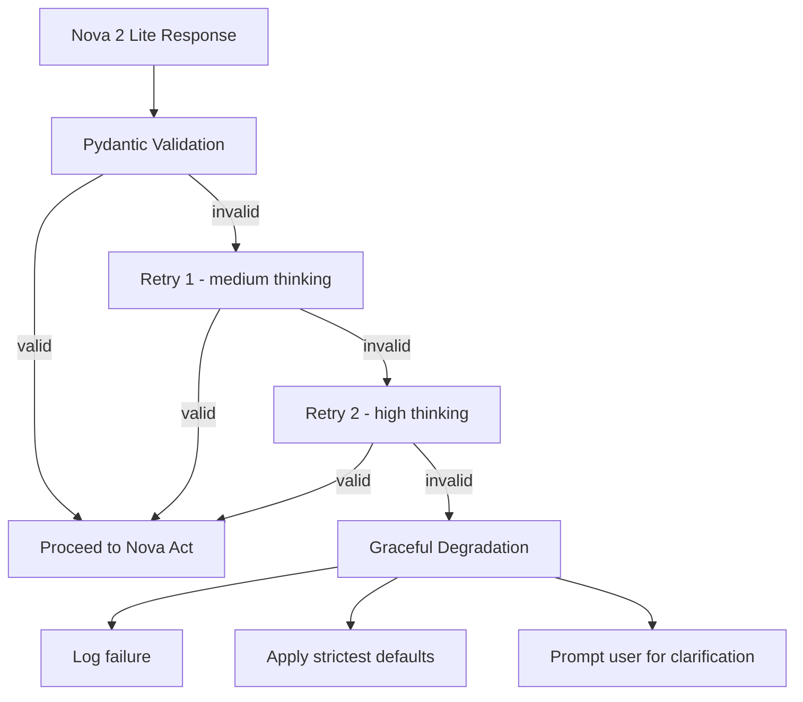
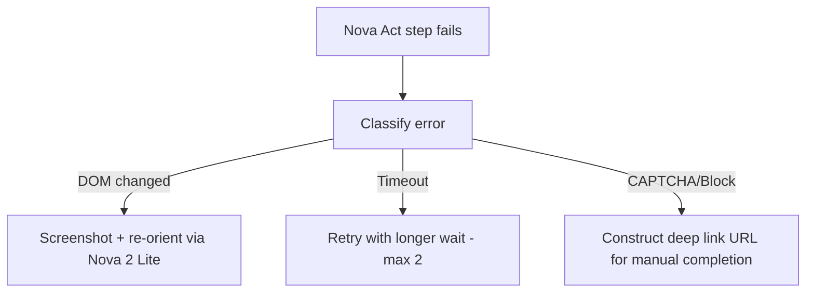

# Error Handling & Resilience

> Related docs: [Architecture Overview](02-architecture-overview.md) · [Rules Engine](04-module-rules-engine.md) · [Booking Agent](05-module-booking-agent.md) · [Infrastructure](06-infrastructure.md) · [Observability](10-observability.md)

---

The original design identifies the right error categories but lacks implementation specifics. This section provides concrete patterns.

## 5.1 LLM Reasoning & Schema Failures



Implementation in Step Functions:

```json
{
  "ReasonAndPlan": {
    "Type": "Task",
    "Resource": "arn:aws:lambda:...:ReasonAndPlanFunction",
    "Retry": [
      {
        "ErrorEquals": ["SchemaValidationError"],
        "IntervalSeconds": 2,
        "MaxAttempts": 2,
        "BackoffRate": 1.5
      }
    ],
    "Catch": [
      {
        "ErrorEquals": ["SchemaValidationError"],
        "Next": "GracefulDegradation"
      },
      {
        "ErrorEquals": ["States.ALL"],
        "Next": "NotifyUserOfError"
      }
    ]
  }
}
```

---

## 5.2 RAG Retrieval Failures

| Scenario | Detection | Response |
|---|---|---|
| No chunks above threshold | Max cosine similarity < 0.65 | Apply company-wide strictest defaults (economy, $300 cap, 14-day advance) |
| Low confidence match | Max similarity 0.65–0.75 | Use retrieved chunks but flag with warning; include `"confidence": "low"` in plan |
| High confidence match | Max similarity > 0.75 | Normal processing |
| Empty vector store | Zero results returned | Halt booking; notify user that policy has not been configured; provide travel team contact |

Implementation:

```python
def retrieve_policy_chunks(query_embedding: list, threshold: float = 0.65, top_k: int = 5) -> dict:
    """Retrieve relevant policy chunks with confidence assessment."""

    results = aurora_client.execute(
        """
        SELECT id, content_text, section_title, source_page, content_type,
               1 - (embedding <=> %s::vector) AS similarity
        FROM policy_chunks
        WHERE 1 - (embedding <=> %s::vector) >= %s
        ORDER BY embedding <=> %s::vector
        LIMIT %s
        """,
        [query_embedding, query_embedding, threshold, query_embedding, top_k]
    )

    if not results:
        return {
            "chunks": [],
            "confidence": "none",
            "action": "apply_strict_defaults"
        }

    max_similarity = max(r["similarity"] for r in results)

    return {
        "chunks": results,
        "confidence": "high" if max_similarity > 0.75 else "low",
        "max_similarity": max_similarity,
        "action": "normal" if max_similarity > 0.75 else "flag_low_confidence"
    }
```

---

## 5.3 Execution & Automation Failures (Nova Act)

Browser automation is inherently fragile. The defense-in-depth strategy:

### Layer 1: Preventive Controls

| Control | Implementation |
|---|---|
| Max steps per workflow | Configure `max_steps=50` in Nova Act workflow definition |
| Per-step timeout | 30-second timeout per `act()` call |
| Total workflow timeout | 5-minute timeout at Step Functions level |
| Domain allowlist | Nova Act constrained to approved portal URLs only |

### Layer 2: Recovery Strategies



### Layer 3: Fallback — Deep Link Construction

If Nova Act cannot complete the booking flow, construct a parameterized URL:

```python
def construct_fallback_url(booking_plan: dict) -> str:
    """Build a deep link to the travel portal with pre-filled parameters."""
    params = booking_plan["parameters"]
    base_url = "https://travel-portal.example.com/flights"
    query = urlencode({
        "origin": params["origin"],
        "destination": params["destination"],
        "departure": params["departure_date"],
        "return": params.get("return_date", ""),
        "cabin": params["cabin_class"],
        "max_price": booking_plan["policy_constraints"]["max_budget_usd"]
    })
    return f"{base_url}?{query}"
```

---

## 5.4 Infrastructure Resilience

### Circuit Breaker Pattern (Concrete Implementation)

```python
import time
from dataclasses import dataclass
from enum import Enum

class CircuitState(Enum):
    CLOSED = "closed"      # Normal operation
    OPEN = "open"          # Failing, reject requests
    HALF_OPEN = "half_open"  # Testing recovery

@dataclass
class CircuitBreaker:
    failure_threshold: int = 5
    recovery_timeout: int = 60  # seconds
    failure_count: int = 0
    last_failure_time: float = 0
    state: CircuitState = CircuitState.CLOSED

    def record_failure(self):
        self.failure_count += 1
        self.last_failure_time = time.time()
        if self.failure_count >= self.failure_threshold:
            self.state = CircuitState.OPEN

    def record_success(self):
        self.failure_count = 0
        self.state = CircuitState.CLOSED

    def can_execute(self) -> bool:
        if self.state == CircuitState.CLOSED:
            return True
        if self.state == CircuitState.OPEN:
            if time.time() - self.last_failure_time > self.recovery_timeout:
                self.state = CircuitState.HALF_OPEN
                return True
            return False
        return True  # HALF_OPEN: allow one test request
```

Store circuit state in DynamoDB (shared across Lambda invocations):

```python
# DynamoDB item for circuit breaker state
{
    "circuitId": "travel-portal-booking",
    "state": "closed",
    "failureCount": 0,
    "lastFailureTime": 0,
    "ttl": 1740000000  # Auto-cleanup
}
```

### WebSocket Heartbeat

To prevent the 10-minute idle timeout on API Gateway WebSocket connections:

```python
# Lambda: Heartbeat sender (triggered by EventBridge every 5 minutes)
def send_heartbeat(event, context):
    """Send keepalive to all active WebSocket connections."""
    connections = dynamodb.scan(TableName="TripCortexConnections")
    apigw = boto3.client('apigatewaymanagementapi', endpoint_url=WEBSOCKET_ENDPOINT)

    for conn in connections["Items"]:
        try:
            apigw.post_to_connection(
                ConnectionId=conn["connectionId"],
                Data=json.dumps({"type": "heartbeat"}).encode()
            )
        except apigw.exceptions.GoneException:
            # Connection closed, clean up
            dynamodb.delete_item(
                TableName="TripCortexConnections",
                Key={"connectionId": conn["connectionId"]}
            )
```
