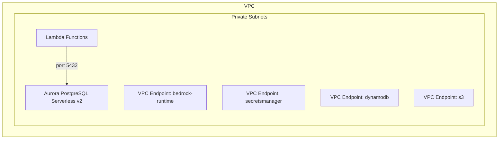

# Security Architecture

> Related docs: [Architecture Overview](02-architecture-overview.md) · [Infrastructure](06-infrastructure.md) · [Observability](10-observability.md)

---

## 6.1 IAM Least Privilege

Each Lambda function gets a scoped IAM role:

| Function | Permissions |
|---|---|
| WebSocketAuthorizer | Clerk session JWT verification via AuthProvider interface (Python Backend SDK), DynamoDB write (connections table) |
| EmbedAndRetrieve | `bedrock:InvokeModel` (Nova MME only), `bedrock:InvokeDataAutomationAsync`, `bedrock:GetDataAutomationStatus`, Aurora Data API read, S3 read (policy PDFs + BDA output), DynamoDB write (audit log table) |
| ReasonAndPlan | `bedrock:InvokeModel` (Nova 2 Lite only), Aurora Data API read, DynamoDB write (audit log table) |
| BookingExecutor | `nova-act:InvokeWorkflow`, Secrets Manager read (portal creds), DynamoDB write (audit log table) |
| ResponseSender | `execute-api:ManageConnections` (WebSocket), DynamoDB read/write (bookings, connections) |
| ConnectionManager | DynamoDB read/write (connections table, bookings table), `states:StartExecution` |

---

## 6.2 Data Protection

| Data | At Rest | In Transit | Access Control |
|---|---|---|---|
| Policy PDFs | SSE-S3 or SSE-KMS | TLS 1.2+ | S3 bucket policy + IAM |
| Vector embeddings | Aurora encryption (AES-256) | TLS 1.2+ | IAM + VPC security groups |
| Booking records | DynamoDB encryption (AWS-managed) | TLS 1.2+ | IAM + DynamoDB fine-grained access |
| Audit logs | DynamoDB encryption (AWS-managed) | TLS 1.2+ | IAM — write-only for workflow Lambdas, read for compliance queries |
| Portal credentials | Secrets Manager (AES-256) | TLS 1.2+ | IAM + resource policy |
| Browser sessions | AgentCore managed | TLS 1.2+ | IAM + session isolation |

---

## 6.3 Network Security



---

## 6.4 Audit Trail

Every decision point is logged to DynamoDB with the following structure:

```json
{
  "auditId": "uuid",
  "bookingId": "uuid",
  "employeeId": "emp-123",
  "timestamp": "2026-03-10T14:30:00Z",
  "event": "policy_evaluation",
  "input": {
    "user_request": "Flight to Chicago next Tuesday...",
    "retrieved_chunks": ["chunk-id-1", "chunk-id-2"]
  },
  "output": {
    "booking_plan": { "...": "..." },
    "reasoning_summary": "..."
  },
  "model_id": "us.amazon.nova-2-lite-v1:0",
  "thinking_budget": "medium",
  "latency_ms": 3200
}
```
