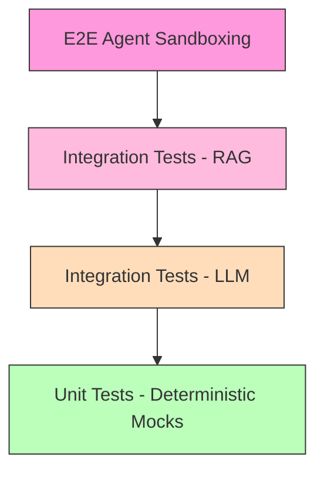

# Testing Strategy

> Related docs: [Architecture Overview](02-architecture-overview.md) · [Rules Engine](04-module-rules-engine.md) · [Booking Agent](05-module-booking-agent.md) · [Observability](10-observability.md) · [Project Structure](12-project-structure.md)

---

## 7.1 Testing Pyramid



- E2E: Nova Act against sandbox portal (daily canary tests)
- Integration RAG: RAG pipeline evaluation via Ragas/TruLens in CI/CD
- Integration LLM: Bedrock API contract tests, schema validation, retries
- Unit: Lambda logic, Pydantic models, circuit breaker, URL construction

---

## 7.2 RAG Evaluation (Knowledge Retrieval Layer)

Use Ragas framework to evaluate embedding quality:

| Metric | What It Measures | Target |
|---|---|---|
| Faithfulness | Did the model invent a policy that doesn't exist? | > 0.90 |
| Answer Relevance | Did the retrieved chunks actually answer the query? | > 0.85 |
| Context Precision | Are the top-ranked chunks the most relevant? | > 0.80 |
| Context Recall | Were all relevant policy sections retrieved? | > 0.85 |

Test dataset: 50+ curated question-answer pairs derived from the actual corporate travel policy PDF.

---

## 7.3 LLM Output Validation (Reasoning Layer)

```python
# test_reasoning.py
import pytest
from unittest.mock import patch
from handlers import reason_and_plan

@pytest.fixture
def mock_bedrock_response():
    return {
        "output": {
            "message": {
                "content": [{
                    "text": json.dumps({
                        "intent": "flight_booking",
                        "confidence": 0.92,
                        "parameters": {
                            "origin": "HYD",
                            "destination": "ORD",
                            "departure_date": "2026-03-10",
                            "return_date": "2026-03-12",
                            "cabin_class": "economy",
                            "passenger_count": 1
                        },
                        "policy_constraints": {
                            "max_budget_usd": 500,
                            "preferred_vendors": ["United", "Delta"],
                            "advance_booking_met": True,
                            "requires_approval": False
                        },
                        "policy_sources": [],
                        "reasoning_summary": "Standard domestic policy applies.",
                        "warnings": []
                    })
                }]
            }
        }
    }

@patch('boto3.client')
def test_valid_booking_plan_passes_schema(mock_client, mock_bedrock_response):
    mock_client.return_value.converse.return_value = mock_bedrock_response
    result = reason_and_plan({"query": "Flight to Chicago", "policy_chunks": []})
    assert result["intent"] == "flight_booking"
    assert result["parameters"]["cabin_class"] == "economy"

def test_return_date_before_departure_fails():
    with pytest.raises(ValueError, match="return_date must be after departure_date"):
        BookingParameters(
            origin="HYD", destination="ORD",
            departure_date="2026-03-12", return_date="2026-03-10",
            cabin_class="economy"
        )

def test_reasoning_content_is_redacted(mock_bedrock_response):
    """Nova 2 Lite returns [REDACTED] for reasoning content.
    Ensure the parser skips reasoningContent blocks and extracts only text blocks."""
    response_with_reasoning = {
        "output": {
            "message": {
                "content": [
                    {"reasoningContent": {"reasoningText": {"text": "[REDACTED]"}}},
                    {"text": json.dumps({"intent": "flight_booking", "...": "..."})}
                ]
            }
        }
    }
    # Parser should extract the text block, not the reasoningContent block
    text_blocks = [
        item["text"] for item in response_with_reasoning["output"]["message"]["content"]
        if "text" in item
    ]
    assert len(text_blocks) == 1
```

---

## 7.4 E2E Agent Sandboxing (Execution Layer)

Daily canary tests against a controlled sandbox:

```python
# canary_test.py — runs daily via EventBridge + Lambda
CANARY_PROMPTS = [
    {
        "request": "Book a flight from HYD to ORD, March 10-12, economy, United preferred",
        "expected": {
            "min_options": 1,
            "cabin_class": "economy",
            "max_price": 500
        }
    },
    {
        "request": "I need a first class flight to NYC tomorrow",
        "expected": {
            "should_downgrade": True,
            "cabin_class": "economy",
            "warning_contains": "first class not permitted"
        }
    }
]
```

If a canary fails, it triggers a CloudWatch Alarm → SNS notification to the engineering team, indicating the travel portal's DOM may have changed.
