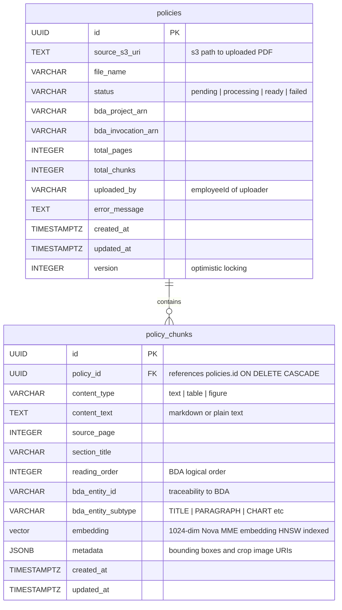
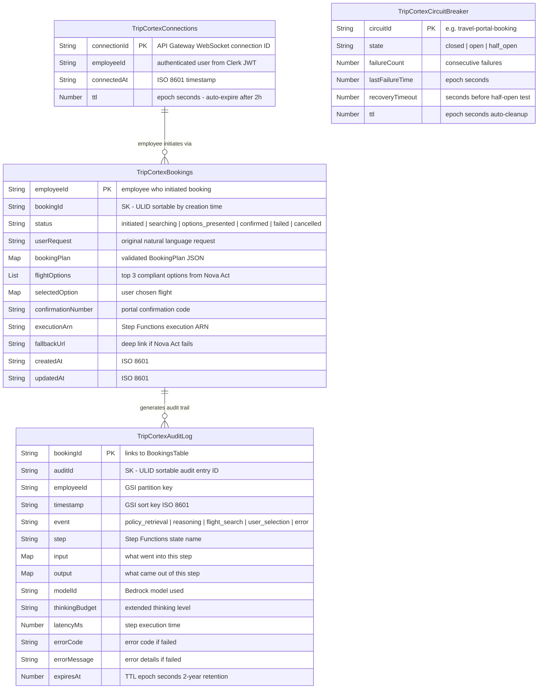
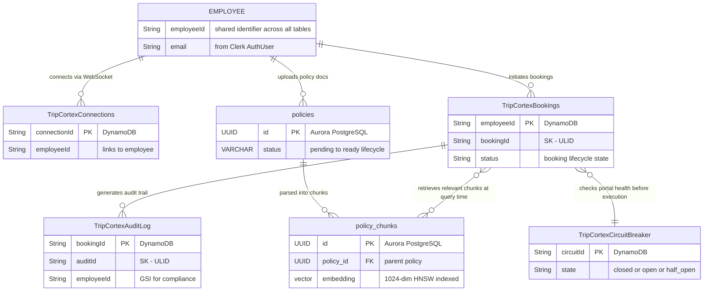
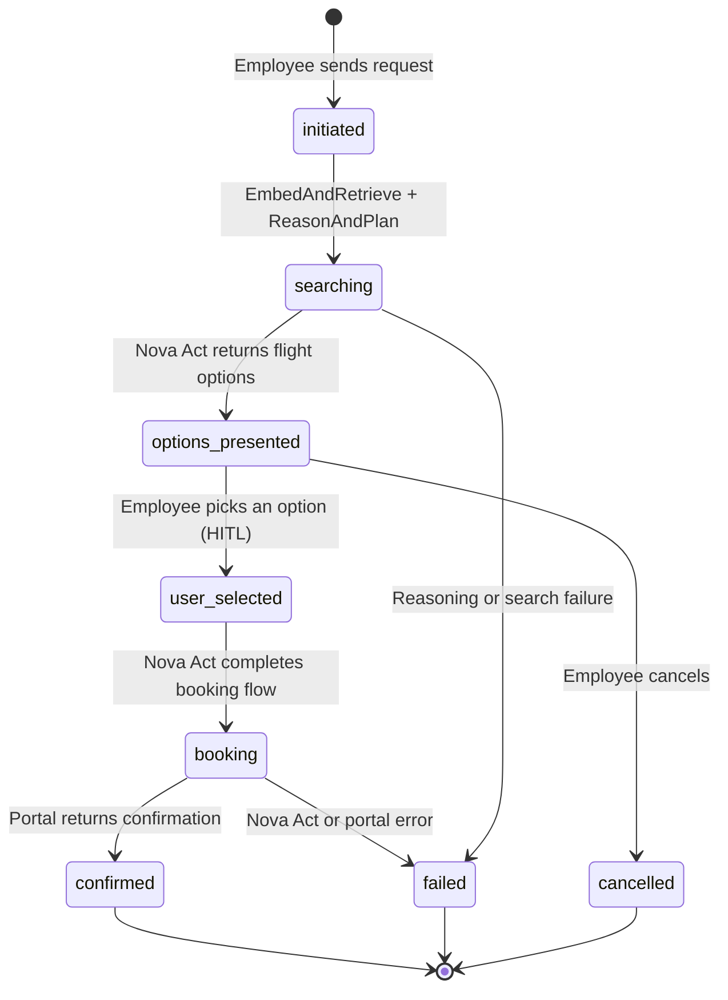

# Trip Cortex — Database Design

> Related docs: [Architecture Overview](02-architecture-overview.md) · [Ingestion Pipeline](03-module-ingestion-pipeline.md) · [Infrastructure](06-infrastructure.md) · [Security](08-security.md)
> ADRs: [002 — Aurora Serverless v2](02-architecture-overview.md) · [003 — 1024 Dimensions](02-architecture-overview.md) · [007 — Single Active Booking](02-architecture-overview.md) · [014 — Separate Audit Table](02-architecture-overview.md)

---

## 1. Storage Strategy: Why Two Databases

Trip Cortex uses two database engines because the system has two fundamentally different data profiles that no single engine serves well.

| Concern | Aurora PostgreSQL (pgvector) | DynamoDB |
|---|---|---|
| Primary role | Semantic vector search over policy embeddings | Operational state: bookings, connections, audit, circuit breakers |
| Access pattern | Read-heavy, complex similarity queries with metadata joins | Key-value lookups, append-only audit writes, TTL-based expiry |
| Schema flexibility | Fixed relational schema — embeddings + metadata are tightly coupled | Schemaless items — each table has a different attribute set |
| Scaling model | Aurora Serverless v2 (0.5–128 ACUs, auto-scales) | On-demand PAY_PER_REQUEST (zero capacity planning) |
| Why not the other? | DynamoDB has no vector index; pgvector similarity search is a hard requirement | Aurora is overkill for simple PK/SK lookups; DynamoDB gives single-digit-ms latency with zero tuning |

Trying to force everything into one engine would mean either running vector search in DynamoDB (impossible) or running high-throughput key-value lookups through Aurora (unnecessary latency and cost). The two-engine approach lets each do what it does best.

---

## 2. Aurora PostgreSQL — Policy Knowledge Base

This is the semantic memory of the system. It stores parsed policy document chunks with their vector embeddings and supports cosine similarity search at query time.

### 2.1 Entity-Relationship Diagram



### 2.2 Table: `policies`

Tracks each uploaded policy document through its lifecycle. Without this table, there's no way to know which chunks belong to which document, re-ingest a specific document, or roll back a failed ingestion.

```sql
CREATE TABLE policies (
    id              UUID PRIMARY KEY DEFAULT gen_random_uuid(),
    source_s3_uri   TEXT NOT NULL,
    file_name       VARCHAR(255) NOT NULL,
    status          VARCHAR(20) NOT NULL DEFAULT 'pending'
                    CHECK (status IN ('pending', 'processing', 'ready', 'failed')),
    bda_project_arn VARCHAR(512),
    bda_invocation_arn VARCHAR(512),
    total_pages     INTEGER,
    total_chunks    INTEGER DEFAULT 0,
    uploaded_by     VARCHAR(255),
    error_message   TEXT,
    created_at      TIMESTAMPTZ NOT NULL DEFAULT NOW(),
    updated_at      TIMESTAMPTZ NOT NULL DEFAULT NOW(),
    version         INTEGER NOT NULL DEFAULT 1
);

CREATE INDEX idx_policies_status ON policies (status);
CREATE INDEX idx_policies_uploaded_by ON policies (uploaded_by);
```

Why this table exists:
- The ingestion pipeline is async (BDA is async-only for documents). We need to track the state of each ingestion job so the orchestrator Lambda can poll for completion and the frontend can show upload status.
- When a policy is re-uploaded, we delete old chunks by `policy_id` and re-ingest. Without a parent record, orphan cleanup is guesswork.
- The `version` column enables optimistic concurrency control — two concurrent status updates won't silently overwrite each other.

### 2.3 Table: `policy_chunks`

This is the existing table (already in the Alembic migration). Each row is one BDA-extracted entity with its Nova MME embedding.

```sql
CREATE TABLE policy_chunks (
    id                  UUID PRIMARY KEY DEFAULT gen_random_uuid(),
    policy_id           UUID NOT NULL REFERENCES policies(id) ON DELETE CASCADE,
    content_type        VARCHAR(20) NOT NULL
                        CHECK (content_type IN ('text', 'table', 'figure')),
    content_text        TEXT,
    source_page         INTEGER,
    section_title       VARCHAR(255),
    reading_order       INTEGER,
    bda_entity_id       VARCHAR(255),
    bda_entity_subtype  VARCHAR(50),
    embedding           vector(1024) NOT NULL,
    metadata            JSONB,
    created_at          TIMESTAMPTZ NOT NULL DEFAULT NOW(),
    updated_at          TIMESTAMPTZ NOT NULL DEFAULT NOW()
);
```

### 2.4 Indexes

```sql
-- Vector similarity search (the core query path)
CREATE INDEX idx_policy_chunks_embedding
    ON policy_chunks USING hnsw (embedding vector_cosine_ops)
    WITH (m = 16, ef_construction = 64);

-- Lookup chunks by policy (for re-ingestion cleanup)
CREATE INDEX idx_policy_chunks_policy_id
    ON policy_chunks (policy_id);

-- Filter by content type during retrieval (optional optimization)
CREATE INDEX idx_policy_chunks_content_type
    ON policy_chunks (content_type);
```

Index design reasoning:

- HNSW over IVFFlat: HNSW gives better recall at query time without needing periodic re-training. IVFFlat requires `VACUUM` after bulk inserts to rebuild cluster centroids. For a corpus under 10K chunks, HNSW's slightly higher memory footprint is negligible, and the query-time advantage matters more.
- `m = 16, ef_construction = 64`: These are the pgvector defaults and are well-suited for corpora under 100K vectors. `m = 16` means each node connects to 16 neighbors (good recall/speed tradeoff). `ef_construction = 64` controls build-time quality — higher values improve recall but slow down inserts. For quarterly policy re-ingestion, insert speed is irrelevant.
- `vector_cosine_ops`: Nova MME embeddings are normalized, so cosine distance is the correct metric. Using L2 distance on normalized vectors would give equivalent ranking but cosine is semantically clearer.

### 2.5 Core Query: Similarity Search

This is the single most important query in the system. It runs on every booking request.

```sql
SELECT
    id,
    content_text,
    section_title,
    source_page,
    content_type,
    bda_entity_subtype,
    1 - (embedding <=> $1::vector) AS similarity
FROM policy_chunks
WHERE 1 - (embedding <=> $1::vector) >= $2   -- threshold (default 0.65)
ORDER BY embedding <=> $1::vector
LIMIT $3;                                      -- top_k (default 5)
```

The `<=>` operator is cosine distance. `1 - distance = similarity`. The WHERE clause pre-filters low-relevance chunks before sorting, which is important because HNSW returns approximate nearest neighbors — without the threshold, you'd get 5 results even if none are relevant.

---

## 3. DynamoDB — Operational State

Four tables, each with a distinct access pattern. All use PAY_PER_REQUEST billing (no capacity planning, scales to zero).

### 3.1 Table Map



GSI on AuditLog: `employeeId-timestamp-index` (PK: `employeeId`, SK: `timestamp`, Projection: ALL) for compliance queries by employee over time ranges.

### 3.2 Table: `TripCortexConnections`

Tracks active WebSocket connections. The API Gateway `$connect` handler writes here; `$disconnect` and the heartbeat Lambda clean up stale entries.

| Attribute | Type | Description |
|---|---|---|
| `connectionId` (PK) | String | API Gateway WebSocket connection ID |
| `employeeId` | String | Authenticated user (from Clerk JWT via AuthProvider) |
| `connectedAt` | String (ISO 8601) | Connection timestamp |
| `ttl` | Number (epoch seconds) | Auto-expire after 2 hours (API Gateway max connection lifetime) |

```json
{
    "connectionId": "abc123xyz",
    "employeeId": "emp-42",
    "connectedAt": "2026-03-10T14:00:00Z",
    "ttl": 1741618800
}
```

Why TTL: WebSocket connections can drop silently (network issues, browser close without `$disconnect`). TTL ensures the table doesn't accumulate ghost connections. The heartbeat Lambda (every 5 min) also proactively cleans up by calling `postToConnection` and deleting entries that return `GoneException`.

Key design: Simple PK on `connectionId` because every access is a direct lookup — the `$connect` handler writes by connectionId, the response sender reads by connectionId, and `$disconnect` deletes by connectionId. No query patterns require a sort key or GSI.

### 3.3 Table: `TripCortexBookings`

The core business record. Stores the full lifecycle of a booking from initial request through confirmation.

| Attribute | Type | Description |
|---|---|---|
| `employeeId` (PK) | String | Employee who initiated the booking |
| `bookingId` (SK) | String (ULID) | Unique booking identifier, sortable by creation time |
| `status` | String | `initiated` → `searching` → `options_presented` → `user_selected` → `booking` → `confirmed` / `failed` / `cancelled` |
| `userRequest` | String | Original natural language request |
| `bookingPlan` | Map | Validated BookingPlan JSON from Nova 2 Lite |
| `flightOptions` | List | Top 3 compliant options from Nova Act |
| `selectedOption` | Map | User's chosen flight |
| `confirmationNumber` | String | Portal confirmation code |
| `executionArn` | String | Step Functions execution ARN (for status tracking) |
| `fallbackUrl` | String | Deep link URL if Nova Act fails |
| `createdAt` | String (ISO 8601) | Booking creation timestamp |
| `updatedAt` | String (ISO 8601) | Last status change |

```json
{
    "employeeId": "emp-42",
    "bookingId": "01JMQX7K3NFGV8RWTB5C6DH2YP",
    "status": "confirmed",
    "userRequest": "Book me a flight to Chicago next Tuesday returning Thursday, prefer United",
    "bookingPlan": {
        "intent": "flight_booking",
        "confidence": 0.95,
        "parameters": {
            "origin": "HYD",
            "destination": "ORD",
            "departure_date": "2026-03-10",
            "return_date": "2026-03-12",
            "cabin_class": "economy"
        },
        "policy_constraints": {
            "max_budget_usd": 500,
            "preferred_vendors": ["United", "Delta"]
        }
    },
    "flightOptions": [],
    "selectedOption": {},
    "confirmationNumber": "UA-ABC123",
    "executionArn": "arn:aws:states:us-east-1:123456789:execution:BookingWorkflow:01JMQX7K3N",
    "createdAt": "2026-03-10T14:30:00Z",
    "updatedAt": "2026-03-10T14:35:22Z"
}
```

Key design reasoning:

- `employeeId` (PK) + `bookingId` (SK): This is the ADR-007 decision. PK on employeeId means "get all bookings for this employee" is a single Query operation — the most common read pattern (employee views their booking history). SK on bookingId (ULID) gives natural chronological ordering and supports the future concurrent-bookings requirement without migration.
- No GSI for status: In MVP, the single-active-booking check is done by querying `employeeId` and filtering on `status NOT IN ('confirmed', 'failed', 'cancelled')`. With one active booking per employee, this scans at most a handful of items. A GSI on status would be premature optimization for a table that will have < 10K items in the first year.
- ULID over UUID for bookingId: ULIDs are lexicographically sortable by creation time, which means DynamoDB's sort key ordering naturally gives "most recent booking first" without a separate timestamp sort key. UUIDs are random and would require a GSI on a timestamp attribute for chronological queries.

### 3.4 Table: `TripCortexAuditLog`

Per ADR-014, this is a separate table from bookings. Every Step Functions step writes an audit entry here — policy evaluation, reasoning output, Nova Act actions, HITL decisions.

| Attribute | Type | Description |
|---|---|---|
| `bookingId` (PK) | String (ULID) | Links to BookingsTable |
| `auditId` (SK) | String (ULID) | Unique, sortable audit entry ID |
| `employeeId` | String | For GSI compliance queries |
| `timestamp` | String (ISO 8601) | Event timestamp (GSI sort key) |
| `event` | String | Event type: `policy_retrieval`, `reasoning`, `plan_validation`, `flight_search`, `user_selection`, `booking_completion`, `error` |
| `step` | String | Step Functions state name |
| `input` | Map | What went into this step (request, chunks, plan) |
| `output` | Map | What came out (plan, options, confirmation) |
| `modelId` | String | Bedrock model used (if applicable) |
| `thinkingBudget` | String | Extended thinking level used |
| `latencyMs` | Number | Step execution time |
| `errorCode` | String | Error code if step failed |
| `errorMessage` | String | Error details if step failed |
| `expiresAt` | Number (epoch seconds) | TTL — 2-year retention for compliance |

GSI: `employeeId-timestamp-index`
- PK: `employeeId`, SK: `timestamp`
- Projection: ALL
- Purpose: "Show me all audit entries for employee X in the last 30 days" — compliance and investigation queries.

```json
{
    "bookingId": "01JMQX7K3NFGV8RWTB5C6DH2YP",
    "auditId": "01JMQX7M2ABCD1234EFGH5678",
    "employeeId": "emp-42",
    "timestamp": "2026-03-10T14:30:05Z",
    "event": "policy_retrieval",
    "step": "EmbedAndRetrieve",
    "input": {
        "user_request": "Flight to Chicago next Tuesday...",
        "query_embedding_dim": 1024
    },
    "output": {
        "chunks_retrieved": 5,
        "max_similarity": 0.89,
        "confidence": "high"
    },
    "modelId": "amazon.nova-2-multimodal-embeddings-v1:0",
    "latencyMs": 450,
    "expiresAt": 1804154400
}
```

Why separate from BookingsTable (ADR-014 rationale, expanded):

1. Write throughput isolation: A single booking generates 10-15 audit entries in rapid succession. In a single-table design, these would all hit the same `employeeId` partition as the booking item itself, creating a hot partition during the booking flow. Separate table = separate partition space.
2. Independent TTL: Booking records may need indefinite retention (employee needs to reference past trips). Audit logs have a compliance window (2 years). Separate TTL policies without filtering logic.
3. IAM scoping: Workflow Lambdas (EmbedAndRetrieve, ReasonAndPlan, ExecuteSearch) get write-only access to the audit table. They never need to read or write booking records. Separate table = tighter IAM boundaries.
4. Query pattern divergence: Bookings are read-heavy (employee checks status). Audit is write-heavy (append-only during workflow) with rare reads (investigation/compliance). DynamoDB optimizes partition distribution per table based on observed patterns.

### 3.5 Table: `TripCortexCircuitBreaker`

Stores circuit breaker state for the travel portal. Shared across Lambda invocations (Lambda is stateless, so in-memory circuit breakers reset on cold starts).

| Attribute | Type | Description |
|---|---|---|
| `circuitId` (PK) | String | Circuit identifier, e.g. `travel-portal-booking` |
| `state` | String | `closed` / `open` / `half_open` |
| `failureCount` | Number | Consecutive failures |
| `lastFailureTime` | Number (epoch seconds) | When the last failure occurred |
| `recoveryTimeout` | Number (seconds) | How long to wait before half-open test |
| `ttl` | Number (epoch seconds) | Auto-cleanup of stale entries |

```json
{
    "circuitId": "travel-portal-booking",
    "state": "closed",
    "failureCount": 0,
    "lastFailureTime": 0,
    "recoveryTimeout": 60,
    "ttl": 1741618800
}
```

Why DynamoDB for circuit breaker state: Lambda functions are stateless. An in-memory circuit breaker resets on every cold start, which defeats the purpose. DynamoDB gives shared, durable state across all concurrent Lambda invocations with single-digit-ms reads. The alternative (ElastiCache/Redis) would add another infrastructure component for a single key-value pair — not worth it.

Conditional writes for thread safety: Circuit breaker state transitions use DynamoDB conditional expressions to prevent race conditions:

```python
# Only transition to OPEN if current state is CLOSED and failure count matches
dynamodb.update_item(
    TableName="TripCortexCircuitBreaker",
    Key={"circuitId": {"S": "travel-portal-booking"}},
    UpdateExpression="SET #s = :open, failureCount = :count",
    ConditionExpression="#s = :closed AND failureCount = :expected",
    ExpressionAttributeNames={"#s": "state"},
    ExpressionAttributeValues={
        ":open": {"S": "open"},
        ":closed": {"S": "closed"},
        ":count": {"N": str(new_count)},
        ":expected": {"N": str(expected_count)}
    }
)
```

---

## 4. Access Patterns Summary

This is the single most important section for validating the design. Every table and index exists to serve a specific access pattern. If a pattern isn't listed here, the schema doesn't need to support it.

### Aurora PostgreSQL

| # | Access Pattern | Table | Method | Frequency |
|---|---|---|---|---|
| A1 | Find relevant policy chunks for a user query | `policy_chunks` | HNSW cosine similarity search + threshold filter | Every booking request |
| A2 | Delete all chunks for a policy (re-ingestion) | `policy_chunks` | DELETE WHERE policy_id = ? | On policy re-upload |
| A3 | Insert chunks during ingestion | `policy_chunks` | Batch INSERT | On policy upload |
| A4 | Track policy ingestion status | `policies` | SELECT/UPDATE by id | During ingestion pipeline |
| A5 | List all policies | `policies` | SELECT all, ordered by created_at | Admin dashboard |
| A6 | Get policy by status | `policies` | SELECT WHERE status = ? | Orchestrator polling |

### DynamoDB

| # | Access Pattern | Table | Key/Index | Frequency |
|---|---|---|---|---|
| D1 | Store WebSocket connection | Connections | PK: connectionId | On $connect |
| D2 | Get connection for message delivery | Connections | PK: connectionId | Every WebSocket message |
| D3 | Delete connection on disconnect | Connections | PK: connectionId | On $disconnect |
| D4 | List all connections (heartbeat) | Connections | Scan | Every 5 minutes |
| D5 | Create booking record | Bookings | PK: employeeId, SK: bookingId | On booking request |
| D6 | Get active booking for employee | Bookings | PK: employeeId, filter on status | On new booking request (single-active check) |
| D7 | Update booking status | Bookings | PK: employeeId, SK: bookingId | Each workflow step |
| D8 | Get booking by employee + bookingId | Bookings | PK: employeeId, SK: bookingId | Status check, HITL resume |
| D9 | List employee's booking history | Bookings | PK: employeeId (Query) | Employee dashboard |
| D10 | Write audit entry | AuditLog | PK: bookingId, SK: auditId | Every workflow step (10-15 per booking) |
| D11 | Get audit trail for a booking | AuditLog | PK: bookingId (Query) | Investigation, debugging |
| D12 | Get audit entries for employee by time range | AuditLog | GSI: employeeId + timestamp | Compliance reporting |
| D13 | Read circuit breaker state | CircuitBreaker | PK: circuitId | Before every Nova Act invocation |
| D14 | Update circuit breaker state | CircuitBreaker | PK: circuitId (conditional write) | On Nova Act success/failure |

### Pattern D4 (Scan) justification

The heartbeat Lambda scans the entire ConnectionsTable every 5 minutes. Scans are generally an anti-pattern in DynamoDB, but here it's justified:
- The table is small (< 500 concurrent connections even at scale)
- It runs on a schedule, not in the request path
- The alternative (GSI on employeeId) doesn't help because we need ALL connections, not a subset
- TTL handles most cleanup; the scan is a safety net for connections that dropped without `$disconnect`

---

## 5. Data Flow Through the Schema

### 5.1 Cross-Database Entity Relationships

This diagram shows how entities across both databases relate to each other through shared identifiers. The `employeeId` and `bookingId` are the glue between the two storage engines.



### 5.2 Booking Lifecycle State Diagram



### 5.3 Step-by-Step Table Touches

This traces a single booking request through every table touch:

```
1. Employee connects via WebSocket
   → ConnectionsTable: PUT {connectionId, employeeId, ttl}

2. Employee sends "Book me a flight to Chicago..."
   → BookingsTable: PUT {employeeId, bookingId, status=initiated, userRequest}
   → Step Functions starts

3. EmbedAndRetrieve Lambda
   → policy_chunks: HNSW similarity search (A1)
   → AuditLogTable: PUT {bookingId, event=policy_retrieval, output={chunks, similarity}}
   → BookingsTable: UPDATE status=searching

4. ReasonAndPlan Lambda
   → AuditLogTable: PUT {bookingId, event=reasoning, output={bookingPlan}}
   → BookingsTable: UPDATE status=searching, bookingPlan={...}

5. ValidatePlan Lambda
   → AuditLogTable: PUT {bookingId, event=plan_validation}

6. ExecuteSearch (Nova Act on AgentCore)
   → CircuitBreakerTable: GET state (D13)
   → [Nova Act searches portal]
   → CircuitBreakerTable: UPDATE on success/failure (D14)
   → AuditLogTable: PUT {bookingId, event=flight_search, output={options}}
   → BookingsTable: UPDATE status=options_presented, flightOptions=[...]

7. HITL Checkpoint
   → ResponseSender reads ConnectionsTable (D2), sends options via WebSocket
   → Step Functions pauses (waitForTaskToken)

8. Employee selects option 2
   → BookingsTable: UPDATE status=user_selected, selectedOption={...}
   → AuditLogTable: PUT {bookingId, event=user_selection}
   → Step Functions resumes

9. Nova Act completes booking
   → BookingsTable: UPDATE status=confirmed, confirmationNumber=UA-ABC123
   → AuditLogTable: PUT {bookingId, event=booking_completion}
   → ResponseSender sends confirmation via WebSocket

10. Employee disconnects
    → ConnectionsTable: DELETE {connectionId}
```

---

## 6. Capacity & Sizing Estimates (MVP)

### Aurora PostgreSQL

| Metric | Estimate | Reasoning |
|---|---|---|
| Policy documents | 1-5 | Single company, quarterly updates |
| Chunks per document | 50-200 | ~100-page PDF, element-level extraction |
| Total vectors | < 1,000 | Well within HNSW comfort zone |
| Storage per vector | ~4 KB (1024 × float32) | 1024 dimensions × 4 bytes |
| Total vector storage | ~4 MB | Negligible |
| HNSW index size | ~8 MB | ~2x vector data for m=16 |
| Query latency (p95) | < 10 ms | Small corpus, HNSW is fast |
| Aurora ACU range | 0.5-2 ACUs | Bursty reads, scales to near-zero between requests |

### DynamoDB

| Table | Items (Year 1) | Avg Item Size | Monthly WCU | Monthly RCU |
|---|---|---|---|---|
| Connections | < 500 concurrent | ~200 bytes | Low (connect/disconnect) | Low (message delivery) |
| Bookings | ~5,000 | ~2 KB | Low (1 write per step) | Moderate (status checks) |
| AuditLog | ~60,000 | ~1 KB | Moderate (10-15 per booking) | Low (rare reads) |
| CircuitBreaker | 1-3 | ~200 bytes | Very low | Low (1 read per Nova Act call) |

All tables use PAY_PER_REQUEST. At these volumes, the monthly cost is under $10 total.

---

## 7. Design Decisions Not Taken (and Why)

### Single-table DynamoDB design
Rejected. The classic DynamoDB single-table pattern (all entities in one table with PK/SK overloading) works well when entities share access patterns. Here, bookings, connections, audit logs, and circuit breakers have completely different key structures, TTL requirements, IAM scoping needs, and read/write ratios. Four small tables with clear boundaries are easier to reason about, monitor, and secure than one table with complex key overloading. ADR-014 documents the audit-specific reasoning.

### Aurora for everything (including bookings/connections)
Rejected. Bookings and connections are simple key-value lookups. Running them through Aurora adds connection pooling complexity (Lambda + RDS is notoriously painful), VPC cold start latency, and unnecessary cost. DynamoDB gives single-digit-ms latency for these patterns with zero connection management.

### DynamoDB for everything (including vectors)
Impossible. DynamoDB has no vector index capability. The pgvector HNSW index is a hard requirement for semantic similarity search.

### OpenSearch for vectors
Rejected. OpenSearch Serverless supports k-NN vector search, but it's significantly more expensive than Aurora Serverless v2 for this workload (minimum 2 OCUs = ~$350/month vs Aurora's ~$50-100/month). The policy corpus is small enough that pgvector handles it comfortably. OpenSearch would be worth reconsidering if the corpus grows to millions of vectors.

### Pinecone / Weaviate / other managed vector DB
Rejected. Adds an external dependency outside the AWS ecosystem. Aurora pgvector is native to the stack, covered by the same VPC/IAM/encryption controls, and sufficient for the corpus size. External vector DBs make sense at scale (10M+ vectors) where specialized indexing and sharding matter.

### Separate table for flight options
Rejected. Flight options are ephemeral — they exist only between the search step and user selection. Storing them as a nested list in the BookingsTable item is simpler and avoids a join. The options list is at most 3-5 items, well within DynamoDB's 400KB item limit.

---

## 8. Migration Strategy

The existing Alembic migration creates `policy_chunks` but not `policies`. The updated migration should:

1. Create `policies` table first (parent)
2. Add foreign key from `policy_chunks.policy_id` → `policies.id` with `ON DELETE CASCADE`
3. Add the `content_type` CHECK constraint
4. DynamoDB tables are created via SAM template (CloudFormation), not Alembic

The `ON DELETE CASCADE` on the foreign key means deleting a policy automatically removes all its chunks — clean re-ingestion without orphans.

---

*This design supports the MVP scope (single policy, single portal, single active booking per employee) while the key structures (employeeId/bookingId composite key, separate audit table, policies parent table) are forward-compatible with the post-MVP roadmap (concurrent bookings, multi-policy, multi-portal).*
